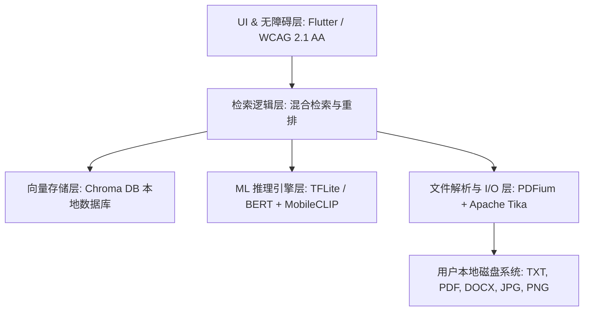
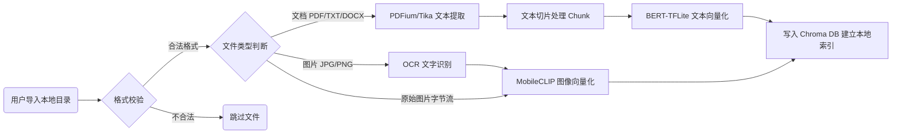
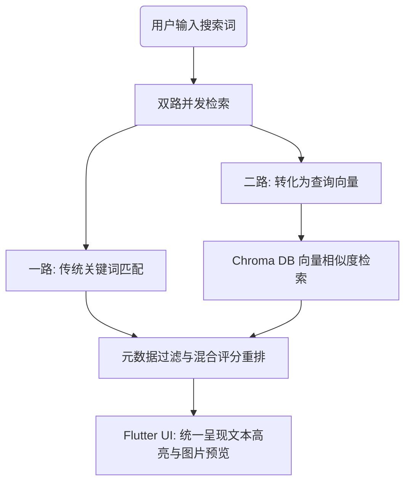

# 离线多模态本地内容检索系统 - 产品需求文档 (PRD)

| 属性 | 内容 |
| :--- | :--- |
| **项目周期** | 8 周 (2 个月) |
| **开源协议** | Apache 2.0 |
# Signed-off Project Requirements Document(PRD)
## Functional requirement
1. 多格式本地文件解析功能 (File Parsing)。系统必须能够直接读取并处理用户个人设备上的非结构化本地文件。
   * **多格式支持**：必须支持 TXT、PDF、DOCX、JPG、PNG 等文件格式的读取与解析。
   * **文本提取**：调用解析引擎（PDFium 和 Apache Tika）提取文档内的文字内容。
   * **图像与截图处理**：支持对本地图片、截图、扫描件进行解析 ，需结合文字识别技术提取其中的印刷文字。
   * **结构化元数据提取**：自动提取文件的通用系统属性（如文件名、路径、大小、时间）以及文件特有属性(如 PDF 页数、图片分辨率等)。
   * **批量文件摄取**： 能够支持对大批量本地文件库进行一键导入和自动化批处理。

2. 多模态本地嵌入引擎功能 (Multimodal Embedding Engine)。系统需要具备在本地将非结构化内容转化为机器可理解的数学向量的能力。
   * **文本向量化**： 集成转换为 TensorFlow Lite 格式的 BERT 模型，在本地 CPU 上将提取的文本段落转化为语义向量 。
   * **图像向量化**： 集成 MobileCLIP 模型，在本地端侧将图片或截图的视觉特征转化为相同维度的语义向量 。
   * **统一处理接口**： 提供一个标准化接口，使文本和图片这两种不同类型的数据在转化后可以被统一调度 。

3. 本地向量存储与混合检索功能 (Vector Storage & Retrieval Logic)。系统需要实现高效的本地索引搭建以及智能化的搜索逻辑。
   * **本地向量数据库管理**： 集成 Chroma DB，在本地对所有转化后的语义向量进行存储和索引维护 。
   * **混合语义检索（Hybrid Retrieval）**： 用户输入搜索词后，系统必须支持“传统关键字匹配 + AI向量相似度评分”的复合检索模式 。
   * **跨模态检索（Cross-Modal Search）**：
     * 以文搜文： 通过文字查找语义相关的本地文档或段落。
     * 以文搜图： 用户输入文字描述，系统能够从本地图片、截图或 PDF 页面中匹配出视觉内容最相符的结果。
   * **结果排序与过滤**： 结合混合评分对检索出的文本和图片结果进行统一的相关度排序 ，并允许用户利用文件类型、时间等元数据进行精准筛选 。

4. 跨平台用户界面交互功能 (Cross-Platform UI)。系统需要提供一个直观、易用的图形交互界面。
   * **文件库管理界面**： 供用户查看、导入、管理本地需要建立索引的文件夹或文件库。
   * **搜索主界面**： 包含输入框、检索按钮以及筛选条件勾选框 。
   * **结果展示界面**： 统一呈现检索出来的文本段落和图片预览，并标明关联度 。
   * **系统设置界面**： 供用户调节系统参数、查看本地索引状态等 。

5. 无障碍辅助功能 (Accessibility Features)。为了践行全球辅助功能承诺并服务视障用户 ，系统界面必须强制提供以下交互功能。
   * **屏幕阅读器完全适配**： 界面所有元素必须无缝支持系统的屏幕阅读器（如 Windows 的 NVDA 和 macOS 的 VoiceOver），确保所有文本、按钮和图片均有正确的标签朗读 。
   * **全键盘导航（Keyboard-only Navigation）**： 允许用户完全脱离鼠标，仅通过键盘（如 Tab 键、方向键、回车键）就能流畅操作系统的所有核心功能 。
   * **高对比度模式（High-contrast Mode）**： 专为弱视用户设计，支持一键切换高对比度主题界面以提升文字辨识度 。
   * **动态字体缩放（Dynamic Font Scaling）**： 界面文字大小必须能够随着系统字体的放大而动态调整，且布局不发生错乱 。

6. 风险与数据安全审查功能 (Risk & Security Audit)
   * **风险管理自检**：系统需内置本地风险自检机制，在初始环境搭建与运行时，对本地环境及依赖进行安全校验。
   * **离线无泄漏审计**：系统需通过端侧数据审查，确保生成的所有临时文件、缓存和日志均留在本地，无向外泄露数据的隐患。

## Non-Functional requirement
1. 离线第一与本地限制 (Offline-First & Local Constraints)。旨在保护隐私并确保在无网环境下可用。
   * **零网络依赖**： 所有的核心业务逻辑（包括文件解析、嵌入向量计算、数据库存储和相似度检索）必须 100% 在端侧（用户本地设备）运行，系统在运行期间绝不能向外发起任何网络请求 。
   * **本地数据安全**： 系统必须通过安全审查，确保用户的个人数据、隐私文件以及生成的向量索引完全停留在本地，无任何数据泄漏风险 。

2. 辅助功能合规性标准 (Accessibility Compliance)。为了消除残障人士（特别是视障群体）的使用障碍，系统界面设计必须满足国际硬性指标。
   * **WCAG 2.1 AA 标准**： 用户界面（UI）的色彩对比度、元素标签和交互逻辑必须严格达到 WCAG 2.1 AA 级别 的无障碍合规性 。
   * **工具验证通过**： 界面必须能够成功通过 Google Accessibility Scanner 和 WAVE 等官方无障碍验证工具的扫描与合规性审查，不能有致命的无障碍漏洞 。
  
3. 跨平台兼容性 (Cross-Platform Compatibility)。
   * **统一代码库跨平台**： 借助 Flutter UI 框架和可移植的底层引擎，系统必须能够同时在 Windows、macOS 和 Linux 三大主流桌面操作系统上顺利编译、打包并稳定运行 。

4. 性能与延迟指标 (Performance & Latency)。由于系统运行在用户的本地消费级硬件（普通的电脑 CPU）上，因此必须对资源消耗和响应速度进行严格控制。
   * **端侧推理优化**： 模型（BERT 和 MobileCLIP）必须经过优化（如转换为 TensorFlow Lite 格式），以降低在本地 CPU 上的嵌入推理延迟 。
   * **内存与资源控制**： 在处理大规模本地文件库的批量摄取和检索时，系统必须控制内存占用（Memory Footprint），防止因内存溢出（OOM）导致软件崩溃 。
   * **高速向量检索**： 本地向量数据库（Chroma DB）必须在大数据量下依然保持快速的相似度搜索与响应能力 。
   * **模型准确度基准（Benchmark）**：文本嵌入需通过 Natural Questions (NQ) 数据集验证，图像嵌入需通过 COCO 数据集验证，确保模型离线转换后的准确度符合基准预期。

5. 代码质量与可维护性 (Code Quality & Maintainability)。
   * **高测试覆盖率**： 核心模块（解析、嵌入、检索等）在交付时，其单元测试覆盖率必须 $\ge90\%$，以确保代码的鲁棒性和稳定性 。
   * **代码规范**： 整体架构设计和代码编写必须严格遵循 Google 的清洁代码原则（Clean Code Principles） 和软件工程最佳实践 。
  
6. 开源合规性 (Open Source Compliance)
   * **许可证合规**： 项目本身需采用 Apache 2.0 协议 开放源代码，且项目中引用的所有第三方开源依赖库（如 Apache Tika、Chroma DB 等）的许可证必须与 Apache 2.0 兼容，无协议冲突 。

# Interface Definitions
## 文件解析模块接口定义 (File Parsing Module Interface)
* 本模块作为数据摄取流水线（Data Ingestion Pipeline）的第一步，负责直接读取本地的非结构化文件，利用底层解析引擎（PDFium 与 Apache Tika）提取文件中的纯文本内容及结构化元数据 。所有操作必须 100% 在本地端侧运行。
1. 单文件解析接口：parseFile
   * 接口描述：接收单个本地文件的路径，自动识别格式并调用对应引擎解析，返回提取的文本与元数据。
   * 调用方式：`Future<ParseResult> parseFile(String filePath)`
* 输入参数说明:

   | 参数名称 | 数据类型 | 示例值 | 参数说明 |
   | :---- | :---- | :---- | :---- |
   | filePath | String | D:/User/Docs/project.pdf | 本地文件的绝对物理路径 | 

* 输出数据结构 (ParseResult), 解析成功时返回的对象应包含以下字段：

   | 字段名称 | 数据类型 | 说明 | 对应支持格式 |
   | :---- | :---- | :---- | :---- |
   | isSuccess | bool | 标记该文件是否解析成功 | 所有格式 | 
   | fileType | String | 检测出的标准文件类型（TXT, PDF, DOCX, JPG, PNG） | 所有格式 | 
   | extractedText | String | 提取出的纯文本内容。若为图片/截图，则为 OCR 识读后的印刷文字 | 所有格式 | 
   | metadata | Map<String, dynamic> | 结构化元数据键值对 | 所有格式 | 

* metadata 子字段约定：
   * 通用系统属性：fileName (文件名), filePath (路径), fileSize (大小/字节), lastModified (修改时间) 。
   * 文件特有属性：PDF 格式包含 pageCount (页数) ；图片格式（JPG/PNG）包含 width (宽度像素), height (高度像素) 。

* 异常与错误码定义, 解析失败时，系统不中断运行，通过包装的错误码向 UI 层反馈，以便屏幕阅读器准确朗读:

   | 错误代码 (String) | 错误信息 (String) | 触发场景 |
   | :---- | :---- | :---- |
   | ERR_FILE_NOT_FOUND | 本地文件路径不存在或无读取权限 | 文件在盘符中被移动、删除，或系统权限不足 |
   | ERR_UNSUPPORTED_FORMAT | 不支持的文件格式类型 | 传入了非 TXT/PDF/DOCX/JPG/PNG 的文件 |
   | ERR_ENGINE_CRASH | 底层解析引擎解析失败 | 文件损坏，导致 PDFium 或 Apache Tika 无法读取 |

2. 批量文件解析接口：parseBatchFiles
   * 接口描述：支持对大批量本地文件库进行自动化批处理摄取，内部采用多线程或异步队列调用 parseFile 。
   * 调用方式：`Stream<BatchProgress> parseBatchFiles(List<String> filePaths)`
* 输入参数说明:
  
   | 参数名称 | 数据类型 | 示例值 | 参数说明 |
   | :---- | :---- | :---- | :---- |
   | filePaths | List<String> | ["C:/a.txt", "C:/b.png"] | 包含多个本地文件绝对路径的列表 | 

* 输出数据结构 (BatchProgress), 此接口采用流式（Stream）返回，以便前端界面能够实时更新解析进度条，并为视障用户提供动态语音状态提示 。每次流推送的对象包含：
  
   | 字段名称 | 数据类型 | 说明 |
   | :---- | :---- | :---- |
   | totalCount | int | 本批次待处理的文件总数 |
   | processedCount | int | 当前已完成解析（含成功和失败）的文件数量 |
   | currentFilePath | String | 当前正在解析的文件路径 |
   | latestResult | ParseResult | 当前刚解析完成的单个文件结果（包含该文件的文本和元数据）|

* 异常处理机制
   * 容错策略：批量解析过程中，若单个文件发生 ERR_ENGINE_CRASH 或 ERR_UNSUPPORTED_FORMAT，系统必须记录日志并继续解析队列中的下一个文件，绝不能导致整个批量任务中断或应用崩溃。
## 多模态本地嵌入引擎接口 (Multimodal Embedding Engine Interface)
* 本模块属于数据处理流水线的核心中枢，负责承接文件解析模块提取出的纯文本或图像数据 。系统调用转换为 TensorFlow Lite 格式的本地模型（BERT-base 与 MobileCLIP），在本地 CPU 上将这些非结构化数据转化为高维度的特征向量（特征向量的维度两模型需保持一致或经底层对齐），以便后续写入 Chroma DB 向量数据库进行检索 。
1. 文本向量化接口：generateTextEmbedding
   * 接口描述：接收一段文本切片（Chunk），调用本地 BERT-TFLite 推理引擎，返回其对应的语义向量 。
   * 调用方式：`Future<Float32List> generateTextEmbedding(String textChunk)`
* 输入参数说明:
  
   | 参数名称 | 数据类型 | 示例值 | 参数说明 |
   | :---- | :---- | :---- | :---- |
   | textChunk | String | "本项目的开源协议是 Apache 2.0 协议。" | 经过分段处理后的文本段落内容 | 

* 输出数据结构:
  * 返回类型：`Float32List`

* 异常与错误码定义
  | 错误代码 (String) | 错误信息 (String) | 触发场景 |
  | :---- | :---- | :---- |
  | ERR_TXT_EMBED_TIMEOUT | 文本向量化推理超时 | 输入文本过长或本地 CPU 计算资源极度紧张 |
  | ERR_MODEL_NOT_READY | BERT 模型未初始化或加载失败 | 当本地 TFLite 模型文件丢失、损坏或内存不足无法加载 |

2. 图像向量化接口：generateImageEmbedding
   * 接口描述：接收本地图片的字节流或路径，调用本地 MobileCLIP 推理引擎，返回其空间视觉特征向量 。
   * 调用方式：`Future<Float32List> generateImageEmbedding(Uint8List imageBytes)`
* 输入参数说明

   | 参数名称 | 数据类型 | 示例值 | 参数说明 |
   | :---- | :---- | :---- | :---- |
   | imageBytes | Uint8List | [255, 216, 255, ...] | 图片或截图的本地内存二进制字节流 | 

* 输出数据结构
  * 返回类型：`Float32List`。

* 异常与错误码定义
  | 错误代码 (String) | 错误信息 (String) | 触发场景 |
  | :---- | :---- | :---- |
  | ERR_IMG_EMBED_TIMEOUT | 图像向量化推理超时 | 图片分辨率过大或本地算力不足 |
  | ERR_MODEL_NOT_READY | MobileCLIP 模型未加载 | 本地 MobileCLIP 模型文件损坏或端侧执行器初始化失败 |

3. 批量多模态向量化接口：generateBatchEmbeddings
   * 接口描述：项目要求支持大批量文件库的自动化批处理 。该接口批量接收待处理的数据任务，支持文本与图片的混合输入，通过统一接口返回向量化结果 。
   * 调用方式：`Future<List<EmbeddingResult>> generateBatchEmbeddings(List<EmbeddingTask> tasks)`
* 输入数据结构 (EmbeddingTask), 数组中的每一个任务对象包含：
  
   | 字段名称 | 数据类型 | 说明 |
   | :---- | :---- | :---- |
   | taskId | String | 任务唯一标识（通常与文件 ID 关联） |
   | dataType | String | 数据类型，枚举值：TEXT 或 IMAGE |
   | textContent | String | 当 dataType 为 TEXT 时必填，存放待向量化文本 |
   | imageBytes | Uint8List | 当 dataType 为 IMAGE 时必填，存放图片字节流 |

* 输出数据结构 (EmbeddingResult), 返回的列表包含每个任务对应的计算结果：

   | 字段名称 | 数据类型 | 说明 |
   | :---- | :---- | :---- |
   | taskId | String | 对应输入任务的唯一标识 |
   | isSuccess | bool | 该条数据向量化是否成功 |
   | vector | Float32List | 计算生成的语义向量。若失败则为空 |
   | errorCode | String | 失败时的错误码（成功则为 null） |

* 内存及并发控制策略
  * 内部队列限流：由于是在用户本地消费级硬件（普通 CPU）上运行，此接口内部必须实现单例队列或严格限制并发数（如最多 2 个线程并发推理），防止因批量处理大文件库时内存溢出（OOM）导致软件崩溃。
## 本地向量存储与混合检索接口 (Vector Storage & Hybrid Retrieval Interface)
* 本模块负责实现高效的本地索引搭建以及智能化的搜索逻辑 。系统集成 Chroma DB 本地向量数据库，将多模态嵌入引擎生成的特征向量与文件解析模块提取的元数据进行关联存储，并提供“关键词 + 语义向量”的混合检索能力，支持“以文搜文”和“以文搜图”的跨模态检索 。
1. 向量与元数据存储接口：saveVectorAndMetadata
   * 接口描述：将单个文本分片或图片的特征向量、结构化元数据以及内容预览写入本地 Chroma DB 数据库中，并建立索引 。
   * 调用方式：`Future<bool> saveVectorAndMetadata(String documentId, Float32List vector, Map<String, dynamic> metadata, String contentPreview)`

* 输入参数说明
   | 参数名称 | 数据类型 | 示例值 | 参数说明 |
   | :---- | :---- | :---- | :---- |
   | documentId | String | "doc_chunk_102" | 唯一标识符（由文件路径+分片序号生成） | 
   | vector | Float32List | [0.012, -0.345, ...] | 嵌入引擎生成的特征向量 | 
   | metadata | Map<String, dynamic> | {"fileType": "PDF", "page": 3} | 文件的通用和特有元数据，用于后续过滤 |
   | contentPreview | String | "本项目的开源协议是..." | 文本的原始内容或图片的本地路径缩略图 | 

* 输出数据结构
  * 返回类型：bool（true 表示写入成功并索引完成，false 表示写入失败）。

* 异常与错误码定义 
  | 错误代码 (String) | 错误信息 (String) | 触发场景 |
  | :---- | :---- | :---- |
  | ERR_DB_NOT_INITIALIZED | 向量数据库未初始化 | 存储引擎未正常启动或 Chroma DB 本地实例加载失败 |
  | ERR_DB_WRITE_FAILED | 本地数据库写入失败 | 磁盘空间不足或数据库文件被锁定/损坏 |

2. 混合语义检索接口：hybridSearch
   * 接口描述：核心检索入口。接收用户的搜索词及其对应的文本向量，在本地同时进行关键词匹配与向量相似度评分，结合元数据过滤条件，返回统一排序后的混合结果 。
   * 调用方式：`Future<List<SearchResult>> hybridSearch(String queryText, Float32List queryVector, Map<String, dynamic> filterArgs, int topK)`

* 输入参数说明

   | 参数名称 | 数据类型 | 示例值 | 参数说明 |
   | :---- | :---- | :---- | :---- |
   | queryText | String | "Apache 2.0 开源协议" | 用户在搜索框输入的原始文本（用于关键词匹配） | 
   | queryVector | Float32List | [0.112, -0.054, ...] | 将搜索词通过 BERT 模型转化后的查询向量 | 
   | filterArgs | Map<String, dynamic> | {"fileType": "PNG"} | 元数据过滤条件（如限定只搜图片、特定时间段） |
   | topK | int | 20 | 指定返回的相关度最高的结果数量，默认 10 条 | 

* 输出数据结构 (SearchResult)，接口返回一个高相关度排序的列表，包含文本和图片的混合结果 ：

   | 字段名称 | 数据类型 | 说明 |
   | :---- | :---- | :---- |
   | documentId | String | 匹配到的条目唯一标识符 |
   | score | double | 混合检索最终相关度评分（结合了文本相似度与向量相似度）|
   | contentPreview | String | 文本片段内容，或者是本地图片的绝对路径（供 UI 呈现预览）|
   | matchType | String | 命中类型（枚举值：TEXT 表示以文搜文，IMAGE 表示以文搜图） |
   | metadata | Map<String, dynamic> | 该条目关联的完整元数据（文件名、页码、分辨率等）|

* 异常与错误码定义

   | 错误代码 (String) | 错误信息 (String) | 触发场景 |
   | :---- | :---- | :---- |
   | ERR_EMPTY_QUERY | 检索输入为空 | 未输入检索词或生成的查询向量无效 |
   | ERR_DB_QUERY_FAILED | 本地数据库查询异常 | Chroma DB 在进行相似度检索或全表扫描时报错 |

3. 本地索引删除接口：deleteVectorsByPath
   * 接口描述：当用户在文件库中移除了某个文件夹或删除了某文件时，同步清除本地向量数据库中的相关索引，释放空间。
   * 调用方式：`Future<int> deleteVectorsByPath(String filePath)`

* 输入参数说明
  
   | 参数名称 | 数据类型 | 示例值 | 参数说明 |
   | :---- | :---- | :---- | :---- |
   | filePath | String | "D:/User/Docs/project.pdf" | 需要清除索引的本地文件或文件夹路径 | 

* 输出数据结构
   * 返回类型：int（返回从本地数据库中成功删除的向量索引条目总数）。
## 系统状态管理与安全审计接口 (System Status Management & Security Audit Interface)
* 本模块作为整个系统的控制中枢，负责处理系统启动时的环境自检与模型加载、无障碍配置的全局状态同步，以及离线无泄漏的安全审计。它连接了前端 Flutter UI 层与底层的核心计算、存储逻辑，确保系统满足 WCAG 2.1 AA 无障碍标准及 100% 离线隐私限制 。

1. 系统初始化与环境自检接口：initializeEnvironment
   * 接口描述：在应用启动时调用。负责校验本地依赖环境、初始化本地 Chroma DB 实例、预加载 BERT 与 MobileCLIP 的 TFLite 模型文件，并执行内置的本地风险自检 。
   * 调用方式：`Future<InitResult> initializeEnvironment()`

* 输入参数说明
  * 无（系统自动读取本地预设的配置文件与模型路径）。

* 输出数据结构 (InitResult), 初始化完成后返回的状态对象包含：
   | 字段名称 | 数据类型 | 说明 |
   | :---- | :---- | :---- |
   | isSuccess | bool | 全局初始化是否成功。只有当底层数据库和双模型均就绪时返回 true |
   | dbStatus | String | 本地向量数据库状态（枚举值：READY, ERROR, UNINITIALIZED）|
   | textModelLoaded | bool | BERT 文本模型是否成功加载至内存 |
   | imageModelLoaded | bool | MobileCLIP 图像模型是否成功加载至内存 |
   | securityPassed | bool | 本地运行环境安全校验是否通过 |

* 异常与错误码定义, 若初始化过程中任一核心组件失败，需抛出对应的错误码，以便 Flutter 层能够通过屏幕阅读器向视障用户发出明确的声音中断提示：
  
   | 错误代码 (String) | 错误信息 (String) | 触发场景 |
   | :---- | :---- | :---- |
   | ERR_INIT_MODEL_FAILED | 本地端侧推理模型文件缺失或损坏 | 首次安装解压失败，或模型文件被用户误删 |
   | ERR_INIT_DB_CLUSTER | 本地向量数据库存储目录无读写权限 | 磁盘被写保护，或没有系统管理员权限 |
   | ERR_SECURITY_RISK | 本地运行环境存在外部依赖注入风险 | 校验底层依赖时发现不安全的动态链接库注入 |

2. 全局无障碍状态同步接口：updateAccessibilityConfig
   * 接口描述：当视障用户在系统设置界面切换高对比度模式或调整动态字体缩放时，UI 层调用此接口将配置持久化，并通知底层渲染引擎和视图层刷新，确保布局不发生错乱，严格符合 WCAG 2.1 AA 标准 。
   * 调用方式：`Future<bool> updateAccessibilityConfig(AccessibilitySettings settings)`

* 输入数据结构 (AccessibilitySettings)
  
   | 字段名称 | 数据类型 | 默认值 | 说明 |
   | :---- | :---- | :---- | :---- |
   | highContrastMode | bool | false | 是否开启一键高对比度主题主题（专为弱视用户设计）|
   | fontScaleFactor | double | 1.0 | 动态字体缩放倍率（取值范围：1.0 至 2.5）|
   | screenReaderHook | bool | true | 是否强制开启针对 NVDA/VoiceOver 的语义标签增强朗读 |

* 输出数据结构
  * 返回类型：bool（true 表示全局配置应用并保存成功，false 表示保存失败）。

3. 离线无泄漏安全审计接口：runSecurityAudit
   * 接口描述：根据项目“离线第一”及“安全审查”的非功能性需求，该接口用于手动或定时触发端侧数据审查。全面扫描系统生成的临时文件、解析缓存和本地日志，审计是否存在向外泄露数据的隐患 。
   * 调用方式：`Future<AuditReport> runSecurityAudit()`

* 输出数据结构 (AuditReport)
   | 字段名称 | 数据类型 | 说明 |
   | :---- | :---- | :---- |
   | isSecure | bool | 安全审计是否合规（true 表示 100% 留存在本地，无外泄隐患） |
   | networkRequestCount | int | 审计周期内系统向外发起网络请求的次数（合规指标必须严格为 0）|
   | tempFilesCount | int | 当前缓存在本地的临时文件数量 |
   | cacheStorageSize | int | 当前本地解析缓存与向量数据库占用的总磁盘物理空间（单位：字节） |
   | leakageRisks | List<String> | 潜在风险列表。若发现非本地路径引用或异常日志则记录，无风险则为空 |

* 异常处理机制
  * 如果 isSecure 返回 false 或 networkRequestCount > 0，系统必须立刻触发熔断机制，暂停一切本地文件摄取与数据库写入操作，并在 UI 界面弹出高危安全警告。

## 文件库与目录管理接口 (File Library & Directory Management Interface)
1. 添加受管文件夹接口：addManagedFolder
   * 接口描述：用户在 UI 界面点击“导入文件夹”时调用。将一个本地目录路径加入系统的管理列表，并自动触发该目录下所有合法文件的批量解析与向量化流水线。
   * 调用方式：`Future<bool> addManagedFolder(String folderPath)`
* 输入参数说明

   | 参数名称 | 数据类型 | 示例值 | 参数说明 |
   | :---- | :---- | :---- | :---- |
   | folderPath | String | "D:/User/Photos/Screenshots" | 用户选定的本地文件夹绝对路径 | 

* 输出数据结构
  * 返回类型：bool（true 表示目录添加成功并成功启动后台扫描任务；false 表示添加失败）。

* 异常与错误码定义

   | 错误代码 (String) | 错误信息 (String) | 触发场景 |
   | :---- | :---- | :---- |
   | ERR_FOLDER_NOT_EXIST | 本地文件夹路径不存在 | 输入的路径在盘符中不存在 |
   | ERR_DUPLICATE_FOLDER | 该文件夹已被系统管理 | 用户重复导入同一个或已包含的子文件夹 |

2. 获取受管文件夹列表接口：getManagedFolders
   * 接口描述：由文件库管理界面在初始化加载时调用，用以向用户展示当前系统正在对哪些本地目录进行索引维护。
   * 调用方式：`Future<List<FolderInfo>> getManagedFolders()`

* 输出数据结构 (FolderInfo)，返回一个数组，数组中的每个元素代表一个受管文件夹的状态信息：
   | 字段名称 | 数据类型 | 说明 |
   | :---- | :---- | :---- |
   | folderPath | String | 本地文件夹的绝对物理路径 |
   | addedTime | String | 该文件夹被导入系统的时间戳 |
   | fileCount | int | 该文件夹下已被系统成功建立索引的文件总数 |
   | syncStatus | String | 同步状态（枚举值：INDEXING 正在建立索引, COMPLETED 索引已就绪, ERROR 扫描异常） |

3. 移除受管文件夹接口：removeManagedFolder
   * 接口描述：用户在界面上删除某个不再需要检索的文件夹时调用。系统将其从受管列表中移除，并根据参数决定是否同步销毁 Chroma DB 中属于该文件夹的所有向量索引。
   * 调用方式：`Future<bool> removeManagedFolder(String folderPath, bool deleteAssociatedIndices)`

* 输入参数说明
   | 字段名称 | 数据类型 | 默认值 | 说明 |
   | :---- | :---- | :---- |
   | folderPath | String | - | 需要移除管理的本地文件夹绝对路径 |
   | deleteAssociatedIndices | bool | true | 是否同步删除该文件夹下所有文件已生成的向量索引 |

* 输出数据结构
  * 返回类型：bool（true 表示移除及清理索引成功，false 表示失败）。

# 可视化内容
## 系统多层架构图
* 本图用于规范系统整体的模块化分层，明确定义从底层本地文件系统到最上层用户界面的调用依赖关系，强调 100% 本地端侧运行（Offline-First）的架构限制 。

* UI 与无障碍交互层 (UI & Accessibility Layer)：基于 Flutter 框架构建 。包含文件库管理、搜索主页、结果展示、系统设置四大界面 。强制适配系统的屏幕阅读器（NVDA/VoiceOver），支持全键盘导航、高对比度主题及动态字体缩放 。
* 检索逻辑层 (Retrieval Logic Layer)：核心业务控制中枢。负责路由分发、调度多模态引擎、以及执行“关键词 + 语义向量”的混合检索。
* 向量存储层 (Vector Storage Layer)：集成本地向量数据库 Chroma DB 。负责维护本地文本向量与图片向量的索引、持久化存储以及相似度矩阵计算 。
* ML 推理引擎层 (ML Inference Layer)：基于 TensorFlow Lite 运行 。包含转换为 TFLite 格式的 BERT 模型（文本向量化）与 MobileCLIP 模型（图像向量化） 。
* 文件解析与 I/O 层 (File Ingestion & IO Layer)：调用 PDFium 和 Apache Tika 引擎 。直接对接本地磁盘文件系统，负责 TXT/PDF/DOCX 文档的文本提取及 JPG/PNG 图片的 OCR 印刷文字识别 。

## 数据摄取与索引流水线流程图
* 本图展示大批量本地文件库被一键导入系统后，直至在本地向量数据库中建立索引的完整生命周期数据流向 。

* 触发输入：用户通过 UI 导入本地文件夹路径 。
* 格式过滤：系统遍历目录，按后缀名（TXT, PDF, DOCX, JPG, PNG）过滤出合法文件 。
* 分流解析：
  * 若为文档，调用 PDFium/Tika 提取纯文本 。
  * 若为图片/截图，调用内置 OCR 技术提取其中的印刷文字 。
* 文本切片 (Chunking)：将长文本按照固定长度/重叠度切分为文本片段（Chunk）。
* 多模态向量化：
  * 文本片段输入 BERT-TFLite 模型，生成文本特征向量 。
  * 原始图片/截图输入 MobileCLIP 模型，生成同维度的图像空间特征向量 。
* 持久化存储：将生成的向量、系统与文件特有元数据（如页码、分辨率等）同步写入 Chroma DB 中建立本地索引 。

## 混合与跨模态检索流程图
* 说明用户发起搜索到结果呈现的内在处理逻辑，重点展示“关键字匹配”与“向量检索”的双路并发与合并重排机制 。

* 用户输入：用户在搜索框输入查询词（Query String） 。
* 双路并发检索：
  * 第一路（传统检索）：直接将查询词提交至本地文本索引，进行传统的关键词匹配评分。
  * 第二路（语义检索）：将查询词输入本地 BERT 模型，转化为查询特征向量 ，随后提交给 Chroma DB 进行向量相似度（余弦相似度）计算 。
* 元数据过滤 (Metadata Filter)：结合用户在界面上勾选的筛选条件（如限定文件类型、修改时间），对双路结果进行精准过滤 。
* 混合重排 (Hybrid Ranking & Score Fusion)：使用混合评分算法，将两路检索出的文本片段得分与图片得分进行归一化权重合并，得出最终的相关度总分 。
* 界面统一输出：按总分从高到低排序，在 Flutter 界面上统一呈现检索出来的文本段落（高亮显示）和图片预览 。

