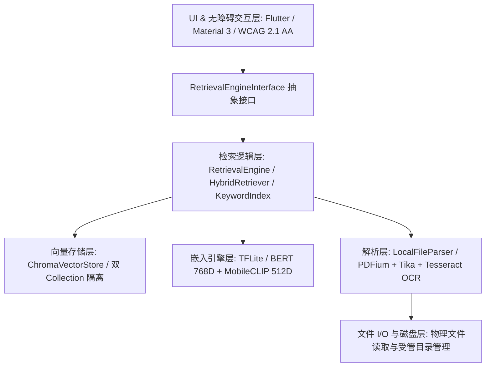
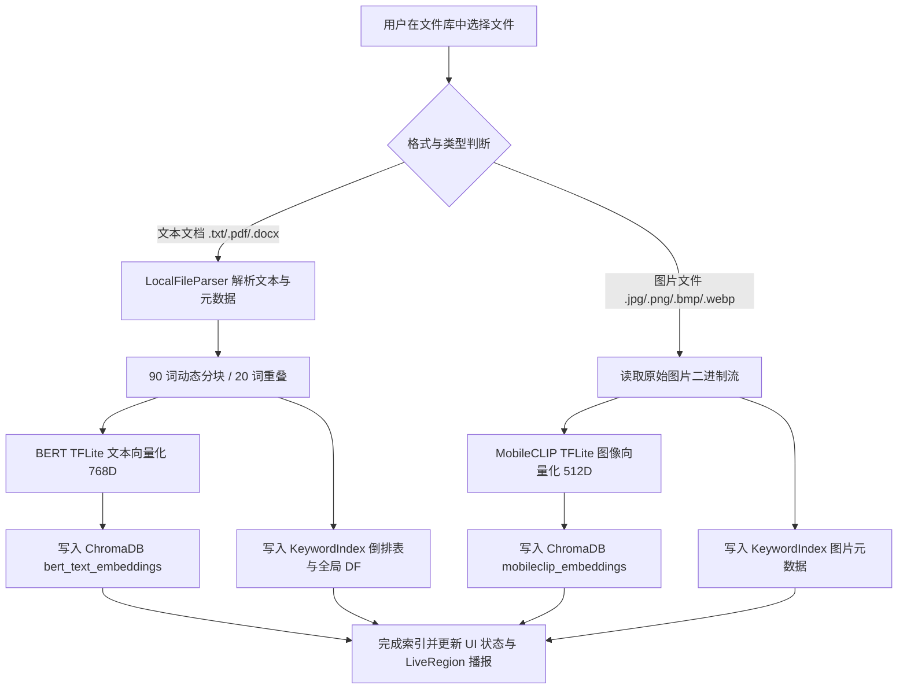
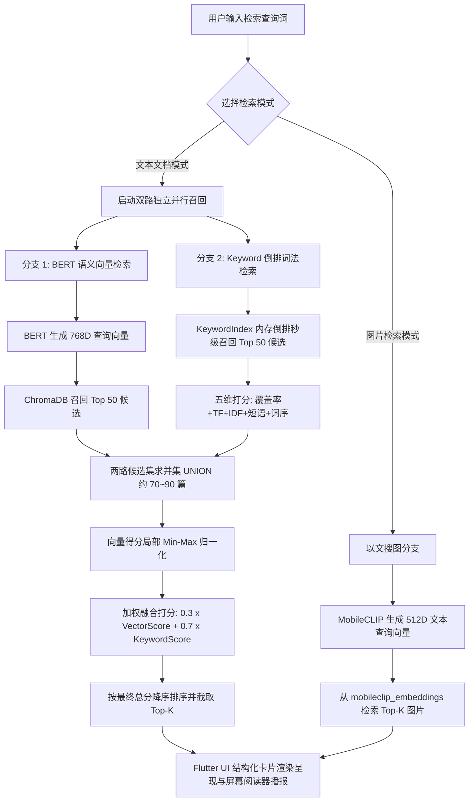

# 离线无障碍多模态本地内容检索系统 - 产品需求文档 (PRD)

| 属性 | 内容 |
| :--- | :--- |
| **项目名称** | 离线无障碍多模态本地内容检索系统 (Offline Accessible Multimodal Local Content Retrieval System) |
| **项目周期** | 8 周 (2 个月) |
| **开源协议** | Apache 2.0（核心源码）；第三方模型与运行库遵循各自开源/研究许可协议 |
| **技术栈** | Flutter (Dart 3.x), TensorFlow Lite (`tflite_flutter`), ChromaDB, Apache Tika 3.3.1, Tesseract OCR, PDFium (`pdfrx`) |

---

# 1. 需求背景与产品定位 (Context & Objectives)

在个人计算与桌面办公场景中，用户设备中积累了海量的非结构化文档（TXT、PDF、DOCX）与多模态图像文件（JPG、PNG、BMP、WEBP）。现有的系统级检索工具通常存在以下局限：
1. **纯字面匹配局限**：传统文件名或字面检索无法理解同义词与深层语义，存在“词汇鸿沟（Vocabulary Mismatch）”。
2. **纯语义检索缺陷**：单纯依赖 AI 向量检索容易导致专有名词、代码变量名、特定型号或编号被模糊化，产生“语义失控”与漏检。
3. **隐私与网络依赖**：云端检索方案存在隐私数据外泄风险，在无网/局域网环境下无法使用。
4. **无障碍支持匮乏**：视障及运动障碍用户在使用传统桌面检索工具时面临屏幕阅读器不适配、无法纯键盘操作等严重障碍。

**本产品定位**：一款 **100% 离线端侧运行、具备 WCAG 2.1 AA 级无障碍交互能力、融合“高维向量语义 + 内存倒排关键词”双路并行召回的多模态本地内容智能检索系统**。

---

# 2. 功能需求 (Functional Requirements)

## 2.1 多格式本地文件解析功能 (File Parsing)
系统必须能够直接读取并处理用户个人设备上的非结构化本地文件，100% 在本地完成解析。
* **多格式支持**：
  * 文档格式：支持 TXT、PDF、DOCX 文件的读取与纯文本解析。
  * 图像格式：支持 JPG、PNG、BMP、WEBP 等常见图像格式。
* **多引擎分流文本提取**：
  * TXT：通过底层文件 I/O 异步读取纯文本。
  * PDF：集成 `pdfrx`（基于 PDFium 底层引擎），逐页提取文档文字内容并统计总页数。
  * DOCX：通过本机回环（`127.0.0.1:9998`）桥接 Apache Tika Server 3.3.1 进行结构化纯文本抽取。
* **图像与 OCR 印刷文字识读**：
  * 支持本地图片读取与尺寸元数据提取。
  * 集成 Apache Tika 与 Tesseract OCR 引擎桥接能力（当前配置为英文 `eng` 语言包），支持提取图片及截图中的印刷文本。
* **结构化元数据提取**：
  * 通用系统属性：文件名（`fileName`）、文件绝对物理路径（`filePath`）、文件大小（`fileSize`，单位字节）、最后修改时间（`lastModified`）。
  * 格式特有属性：PDF 包含总页数（`pageCount`）；图片包含像素宽度（`width`）与高度（`height`）。
* **批量文件摄取与进度反馈**：
  * 支持对大批量本地文件进行异步排队处理。
  * 采用流式（Stream）实时推送批处理进度，包含总数、已完成数、当前文件路径及单文件解析结果。
  * 具备单文件故障隔离机制，单个损坏或未知格式文件解析失败不中断整体批处理任务。

## 2.2 多模态本地嵌入引擎功能 (Multimodal Embedding Engine)
系统需在本地 CPU 端侧将非结构化内容转化为机器可理解的高维数学特征向量，并严格隔离不同的向量语义空间。
* **文本语义向量化 (BERT-base TFLite)**：
  * 集成针对端侧优化转换的 BERT-base 模型（`assets/bert_model/bert.tflite`）。
  * 实现纯 Dart WordPiece 分词器（`BertTokenizer`，词表 `vocab.txt`），支持 `[CLS]`、`[SEP]`、`[PAD]` 特殊标记拼接与最长 128 Token 动态截断。
  * 输出 **768 维** Dense 句向量（`poolerOutput`），专门用于纯文本语义检索（Text-to-Text）。
* **跨模态图文向量化 (MobileCLIP TFLite)**：
  * 集成 MobileCLIP 模型（`mobileclip_image.tflite` 与 `mobileclip_text.tflite`）。
  * **图像端**：通过 `ImagePreprocessor` 将输入图片自动等比降采样与裁剪至 $224 \times 224$ RGB，归一化后输入视觉编码器，输出 **512 维** 空间特征向量。
  * **文本端**：实现 OpenCLIP 兼容的 Byte-level BPE 分词器（`ClipTokenizer`，词表 `bpe_simple_vocab_16e6.txt`，49,408 词表大小，77 Token 定长序列），通过文本编码器输出 **512 维** 向量。
  * **共享语义空间**：文本向量与图像向量在同一个 512 维共享空间中经 L2 归一化对齐，支持“以文搜图（Text-to-Image）”余弦相似度匹配。
* **端侧推理安全与并发限流**：
  * 内置单例推理队列（`InferenceQueue`），严格限制最大并发数 $\le 2$，防止消费级硬件多线程密集推理导致内存溢出（OOM）或界面卡顿。
  * 内置数值安全校验（`_validateEmbedding`），自动拦截 NaN、Infinity 异常值与零向量。

## 2.3 本地向量存储与双路混合检索功能 (Vector Storage & Hybrid Retrieval)
系统需要实现高效的本地索引构建与“语义 + 词法”双路并行召回加权融合检索。
* **本地向量数据库管理 (ChromaDB)**：
  * 集成本地 ChromaDB 实例，通过物理隔离的双 Collection 管理不同维度向量：
    * `bert_text_embeddings`：存储 768 维文本分块向量（`VectorEmbeddingType.bert`）。
    * `mobileclip_embeddings`：存储 512 维图片及跨模态文本向量（`VectorEmbeddingType.mobileClip`）。
  * 支持按文档唯一 ID 精准删除、按源文件物理路径级联删除、向量距离转相似度评分（$Score = \frac{1}{1 + distance}$）。
* **内存级倒排关键词索引 (KeywordIndex)**：
  * 构建应用内存驻留的高性能倒排索引引擎，维护正排表、倒排表（`Token -> Document IDs`）与全局文档频率表（`Token -> DF`）。
  * 引入 **五维度打分模型 (5-Pillar Scoring Model)** 计算词法相关度（归一化至 `[0.0, 1.0]`）：
    $$\text{KeywordScore} = 0.45 \cdot \text{Coverage} + 0.20 \cdot \text{TF}_{\text{squashed}} + 0.20 \cdot \text{IDF}_{\text{squashed}} + 0.10 \cdot \text{PhraseBonus} + 0.05 \cdot \text{OrderedScore}$$
  * 集成停用词策略（`StopWordPolicy`），结合英文停用词表、无障碍关键词白名单、代码领域词库（`DomainDetector`）与动态高频词挖掘，动态调整 Token 权重。
* **双路独立并行召回与分数加权融合 (Hybrid Retrieval)**：
  * **双路并行召回**：输入查询词后，`VectorRetriever` 向向量库检索 $\text{topK} \times 5$ 个语义候选，`KeywordRetriever` 向倒排表检索 $\text{topK} \times 5$ 个关键词候选。
  * **候选集合流 (UNION)**：两路候选求并集生成候选池（约 70~90 篇），彻底杜绝生僻代码或特定编号在向量阶段被截断遗漏。
  * **局部 Min-Max 归一化**：对向量相似度分数进行 Min-Max 归一化，拉大批次内的相对区分度。
  * **加权融合排序**：默认采用 **0.3 向量权重 + 0.7 关键词权重**（经 NQ 真实基准调优确定），加权计算最终总分并按降序截取 Top-K。
* **幂等分块与双写索引流水线 (DocumentIndexer)**：
  * 文本文档按最多 90 词（重叠 20 词）分块，预留膨胀缓冲保证落入 BERT 128 Token 范围。
  * 基于文件绝对路径清洗生成确定性幂等 ID（`_normalizePathForId`），支持重新索引覆盖与精准级联删除。
  * 同步“双写”至 ChromaDB 向量库与 KeywordIndex 倒排索引。
* **跨模态多模式检索**：
  * **文本文档检索**：基于 BERT + 关键词双路混合检索，展示匹配文本摘要与命中标签（语义+关键词、纯语义、纯关键词）。
  * **以文搜图**：输入自然语言描述，通过 MobileCLIP 文本编码器检索 `mobileclip_embeddings` 图片向量库。

## 2.4 跨平台用户界面交互功能 (Cross-Platform UI)
基于 Flutter Material 3 构建跨平台现代化响应式桌面用户界面。
* **响应式导航框架 (HomeShell)**：
  * 窗口宽度 $\ge 720$ 像素时采用左侧 `NavigationRail` 导航栏，较窄时自适应切换为底部 `NavigationBar`。
  * 使用 `IndexedStack` 保持各页面状态，防止切页丢失数据。
  * 包含三大核心页面：**文件库 (LibraryScreen)**、**搜索 (SearchScreen)**、**设置 (Settings)**。
* **文件库管理界面**：
  * 支持调用原生文件选择器（`file_picker`）批量选择多格式文档与图片进行全量索引。
  * 卡片式列表展示已索引文件、文件大小、分块记录数、索引状态（索引中、成功、失败）。
  * 提供单文件“重新索引”与“安全删除索引”操作（带二次防误删确认对话框，明确提示不删除磁盘原文件）。
* **多模态搜索主界面**：
  * 支持“文本文档”与“图片”两种检索模式一键切换。
  * 提供搜索输入框、实时搜索建议、加载状态提示与快捷清空功能。
  * 结构化卡片呈现检索结果：排序序号、文件名、物理路径、匹配文本摘要（最多 240 字符）、相关度百分比、数据类型标签及匹配来源标识。
* **系统设置与状态界面**：
  * 提供高对比度模式一键切换开关。
  * 提供动态文字缩放比例调节控件（支持 100% 至 200%，步长 25%）。
  * 展示系统底层模型与向量库状态信息。

## 2.5 深度无障碍辅助功能 (Accessibility Features - WCAG 2.1 AA)
为了践行全球辅助功能承诺并服务视障及行动障碍用户，系统界面全面贯彻无障碍标准：
* **屏幕阅读器深度适配 (NVDA / VoiceOver)**：
  * 所有可交互元素均显式配置 `Semantics`，提供清晰的 `label`、`hint`、`value` 和 `header` 语义。
  * 文件索引进度与检索状态配置 `Semantics(liveRegion: true)`，实现状态变动时屏幕阅读器自动语音播报。
  * Windows 平台专属优化：针对原生 Slider 在 Windows AXTree 上的崩溃隐患，采用 `Semantics + LinearProgressIndicator + 减小/增大双按钮` 架构，既保留读屏滑块语义与步进动作，又彻底消除崩溃风险。
* **全键盘无障碍导航 (Keyboard-Only Navigation)**：
  * 全流程支持纯键盘操作，通过 `Tab` / `Shift+Tab` 顺畅流转焦点，`Enter` / `Space` 触发操作，焦点指示清晰且无键盘陷阱（Keyboard Trap）。
  * 页面采用 `OrderedTraversalPolicy` 精确控制焦点逻辑遍历顺序。
* **全局无障碍快捷键**：
  * `Alt + 1`：快速跳转至“文件库”页面。
  * `Alt + 2`：快速跳转至“搜索”页面。
  * `Alt + 3`：快速跳转至“设置”页面。
  * `Ctrl + F`（Windows/Linux）/ `Command + F`（macOS）：全局快速聚焦搜索框并切换至搜索页。
* **高对比度模式 (High-Contrast Mode)**：
  * 专为低视力弱视用户设计的高对比度深色主题：纯黑底色（`#000000`）、纯白正文（`#FFFFFF`）、高亮黄色主色（`#FFEB3B`）与青色辅助强调色（`#00E5FF`），色彩对比度远超 WCAG 2.1 AA 4.5:1 的硬性要求。
* **动态字体缩放 (Dynamic Font Scaling)**：
  * 支持 100% 至 200% 全局文字无损放大，通过 `MediaQuery.textScaler` 全局响应式驱动，界面布局在 200% 缩放下自动换行自适应，不发生文字截断或排版错乱。

---

# 3. 非功能性需求 (Non-Functional Requirements)

## 3.1 离线第一与本地安全限制 (Offline-First & Local Constraints)
* **零外部网络依赖**：核心计算、文件解析、向量推理、倒排检索与数据库交互 100% 在用户本地端侧运行，严禁向外发起任何公网网络请求。
* **回环地址通信**：ChromaDB 与 Apache Tika 仅通过本地回环地址（`127.0.0.1` / `localhost`）通信。
* **本地数据隐私**：用户原始文件、解析文本与高维向量索引完全保存在本机磁盘，不上传任何云端遥测或日志。

## 3.2 无障碍合规性标准 (Accessibility Compliance)
* **WCAG 2.1 AA 标准**：用户界面色彩对比度、非文本对比度、焦点可见性、控件可感知性必须全面达到 WCAG 2.1 Level AA 要求。
* **自动化语义测试保障**：在 `test/widget_test.dart` 中建立自动化 Widget 与 Semantics 语义测试套件，覆盖全部快捷键、焦点捕获、LiveRegion 播报、字号缩放及高对比度切换。

## 3.3 跨平台兼容性 (Cross-Platform Compatibility)
* **操作系统支持**：支持 Windows、macOS 和 Linux 桌面操作系统。
* **Windows 专属发布集成**：通过 `windows/CMakeLists.txt` 构建脚本，自动打包分发 Tika Server JAR、`tika-config.xml`、Windows Tesseract OCR 运行时环境（含 `eng.traineddata`）以及 TensorFlow Lite 原生 C++ 动态库（`libtensorflowlite_c-win.dll`）。

## 3.4 性能与延迟指标 (Performance & Latency)
* **端侧推理优化**：
  * BERT 限制 128 Token，采用 TypedData `Float32List` 连续内存存储，激活多核 CPU 并行加速。
  * MobileCLIP 采用 $224 \times 224$ 定长 Float32 张量输入，去除 Flex 算子退化，保持 100% Builtin 算子端侧执行。
* **检索延迟**：在 10,000 级本地分块索引规模下，双路并行召回与加权融合排序单次查询响应时间 $\le 500\text{ ms}$。
* **内存与资源控制**：批量处理与推理时限制并发队列（$\le 2$），单次图片处理及时回收位图内存，防止发生内存溢出（OOM）。

## 3.5 精度与评测基准 (Model Accuracy & Benchmarks)
系统需通过行业标准测试集完成端侧推理与检索精度验证：
* **自然问答文本检索基准 (Natural Questions - NQ 100 样本子集)**：
  * 纯 BERT 向量基线：Recall@1 = 14.0%, Recall@5 = 28.0%, Recall@10 = 34.0%, MRR = 0.2205。
  * **双路混合检索调优后 (0.3 向量 + 0.7 关键词)**：**Recall@1 = 91.0%, Recall@5 = 97.0%, Recall@10 = 98.0%, MRR = 0.9398**，综合检索精度达到极高水准。
* **多模态图文检索基准 (MS-COCO 100 样本子集)**：
  * **文本 $\rightarrow$ 图像检索**：Recall@1 = 64.0%, Recall@5 = 88.0%, Recall@10 = 99.0%, MRR = 0.7518。
  * **图像 $\rightarrow$ 文本检索**：Recall@1 = 66.0%, Recall@5 = 93.0%, Recall@10 = 98.0%, MRR = 0.7764。
  * 证明 MobileCLIP 512 维共享空间具备高度对称且优秀的跨模态检索能力。

## 3.6 代码质量与架构规范 (Code Quality & Maintainability)
* **依赖注入与分层解耦**：UI 层仅依赖统一门面接口 `RetrievalEngineInterface`，不直接耦合底层解析器、模型或数据库。
* **高测试覆盖**：在 `test/` 下维护完备的单元测试、集成测试、基准测试与 Widget 测试套件。
* **健壮的错误处理**：采用强类型 Result 模式与标准化错误代码（如 `ERR_FILE_NOT_FOUND`、`ERR_MODEL_NOT_READY` 等），异常不穿透至 UI 造成崩溃。

## 3.7 开源合规性 (Open Source Compliance)
* **项目代码授权**：本项目自研代码整体采用 **Apache 2.0 许可证** 开源。
* **第三方资产合规治理**：
  * Apache Tika 3.3.1（Apache 2.0）、Tesseract OCR（Apache 2.0）、PDFium（BSD-3-Clause）、ChromaDB（Apache 2.0）。
  * **特别声明（MobileCLIP 预训练模型）**：MobileCLIP 模型权重遵循 **Apple Machine Learning Research Model License Agreement**，仅限非商业科学研究与学术评估用途。商业化分发需取得商业授权或替换为可商用开源权重。
  * 建立 `OPEN_SOURCE_COMPLIANCE_REPORT.md` 与 `THIRD_PARTY_NOTICES.md` 全面追踪依赖许可。

---

# 4. 系统接口定义 (Interface Definitions)

## 4.1 文件解析模块接口 (File Parsing Interface)
文件解析层定义在 `lib/parsing/file_parser_interface.dart` 中：

```dart
abstract interface class FileParserInterface {
  /// 单文件解析接口：接收本地绝对路径，自动识别格式并提取文本及元数据
  Future<ParseResult> parseFile(String filePath);

  /// 批量文件解析接口：流式推送批处理进度与各文件解析结果
  Stream<BatchProgress> parseBatchFiles(List<String> filePaths);
}
```

* **ParseResult 数据结构**：
  | 字段名称 | 数据类型 | 说明 |
  | :--- | :--- | :--- |
  | `isSuccess` | `bool` | 标记该文件是否解析成功 |
  | `fileType` | `String` | 检测出的标准文件类型（TXT, PDF, DOCX, JPG, PNG 等） |
  | `extractedText` | `String` | 提取出的纯文本内容（若为 OCR 则为识别文本） |
  | `metadata` | `Map<String, dynamic>` | 包含 fileName, filePath, fileSize, lastModified 及 pageCount/width/height |
  | `errorCode` | `String?` | 失败时的错误代码（如 `ERR_FILE_NOT_FOUND`, `ERR_UNSUPPORTED_FORMAT`） |
  | `errorMessage` | `String?` | 错误详细原因说明 |

* **BatchProgress 数据结构**：
  | 字段名称 | 数据类型 | 说明 |
  | :--- | :--- | :--- |
  | `totalCount` | `int` | 本批次待处理文件总数 |
  | `processedCount` | `int` | 当前已完成解析（含成功和失败）的文件数 |
  | `currentFilePath` | `String` | 当前正在解析的文件路径 |
  | `latestResult` | `ParseResult` | 刚解析完成的单文件结果对象 |

---

## 4.2 多模态嵌入引擎接口 (Embedding Engine Interface)
嵌入引擎层定义在 `lib/embedding/embedding_engine_interface.dart` 中：

```dart
abstract interface class EmbeddingEngineInterface {
  /// 生成文本向量，可通过 [mode] 显式切换编码器
  /// - TextEmbeddingMode.bert：768 维，用于文本-文本语义检索
  /// - TextEmbeddingMode.mobileClip：512 维，用于图文匹配跨模态检索
  Future<Float32List> generateTextEmbeddingWithMode(
    String text, {
    TextEmbeddingMode mode = TextEmbeddingMode.bert,
  });

  /// 生成图片特征向量（512 维，MobileCLIP 共享语义空间）
  Future<Float32List> generateImageEmbedding(Uint8List imageBytes);

  /// 批量生成文本/图片向量，受单例 InferenceQueue 限流保护，单个失败不中断队列
  Future<List<EmbeddingResult>> generateBatchEmbeddings(
    List<EmbeddingTask> tasks,
  );
}
```

* **辅助门面方法 (`EmbeddingEngine`)**：
  * `Future<Float32List> generateTextEmbedding(String text)`：默认 BERT 文本向量生成快捷入口。
  * `Future<Float32List> generateMultimodalTextEmbedding(String text)`：MobileCLIP 文本向量生成快捷入口。
  * `double cosineSimilarity(Float32List a, Float32List b)`：计算两个同维度向量的余弦相似度。

* **EmbeddingTask 与 EmbeddingResult 模型**：
  * `EmbeddingTask`：包含 `taskId`, `dataType` (`text` / `image`), `textContent`, `imageBytes`, `textMode` (`bert` / `mobileClip`)。
  * `EmbeddingResult`：包含 `taskId`, `isSuccess`, `vector` (`Float32List?`), `errorCode`, `errorMessage`。

---

## 4.3 本地向量存储接口 (Vector Store Interface)
向量存储层定义在 `lib/retrieval/vector_store_interface.dart` 中：

```dart
abstract interface class VectorStoreInterface {
  /// 初始化数据库与 Collections
  Future<void> initialize();

  /// 插入单条向量记录
  Future<void> addDocument(VectorDocument document);

  /// 批量插入向量记录
  Future<void> addDocuments(List<VectorDocument> documents);

  /// 根据 Query Embedding 检索最相似的 Top-K 记录
  Future<List<VectorSearchResult>> search({
    required Float32List queryEmbedding,
    required VectorEmbeddingType embeddingType,
    int topK = 10,
    Map<String, dynamic>? filters,
  });

  /// 根据唯一 ID 删除记录
  Future<void> deleteDocument(String id);

  /// 根据文件源路径级联删除其所有分块记录
  Future<void> deleteBySourcePath(String sourcePath);

  /// 清空指定空间类型的全部数据
  Future<void> clear(VectorEmbeddingType embeddingType);

  /// 统计指定空间类型中持久化的向量记录总数
  Future<int> count(VectorEmbeddingType embeddingType);

  /// 状态与资源释放
  bool get isInitialized;
  Future<void> dispose();
}
```

---

## 4.4 统一检索业务接口 (Retrieval Engine Interface)
检索层对外门面定义在 `lib/retrieval/retrieval_engine_interface.dart` 中：

```dart
abstract interface class RetrievalEngineInterface {
  /// 提取并索引单个本地文件
  Future<IndexingResult> indexFile(String filePath);

  /// 批量索引多个本地文件
  Future<List<IndexingResult>> indexFiles(List<String> filePaths);

  /// 删除指定文件对应的所有索引（Chroma 与 KeywordIndex 同步删除）
  Future<void> removeFile(String filePath);

  /// 重新索引指定文件（先清除旧索引再重新入库）
  Future<IndexingResult> reindexFile(String filePath);

  /// 双路混合文本检索（BERT 语义相似度 + Keyword 词法相似度加权融合）
  Future<List<HybridSearchResult>> searchText({
    required String query,
    int topK = 10,
    Map<String, dynamic>? filters,
  });

  /// 以文搜图（基于 MobileCLIP 512 维共享语义空间）
  Future<List<HybridSearchResult>> searchImages({
    required String query,
    int topK = 10,
  });
}
```

* **HybridSearchResult 数据结构**：
  | 字段名称 | 数据类型 | 说明 |
  | :--- | :--- | :--- |
  | `id` | `String` | 文档分块唯一幂等标识 |
  | `sourcePath` | `String` | 本地文件绝对路径 |
  | `content` | `String?` | 匹配到的文本分块正文（图片条目可为空） |
  | `finalScore` | `double` | 最终混合相关度得分（范围归一化至 `[0.0, 1.0]`） |
  | `normalizedVectorScore` | `double` | 经过 Min-Max 归一化后的向量得分 |
  | `normalizedKeywordScore` | `double` | 归一化后的五维关键词得分 |
  | `foundByVector` | `bool` | 是否被向量语义分支成功召回 |
  | `foundByKeyword` | `bool` | 是否被倒排关键词分支成功召回 |
  | `metadata` | `Map<String, dynamic>` | 包含文件名、扩展名、分块序号等完整元数据 |

---

## 4.5 应用装配与全局无障碍控制器接口 (App Backend & Accessibility Controller)
* **应用装配工厂 (`lib/app/app_backend.dart`)**：
  * `Future<RetrievalEngine> buildRetrievalEngine()`：按依赖拓扑顺序依次初始化 TFLite 模型、WordPiece 分词器、CLIP BPE 分词器、停用词策略（`stopwords_en.json`）、倒排索引（`KeywordIndex`）、Chroma 向量库（`ChromaVectorStore`）、文档索引器（`DocumentIndexer`）与混合检索器（`HybridRetriever`，配置 0.3 向量 + 0.7 关键词权重），装配完成交付 UI 层使用。
* **全局外观与无障碍状态管理器 (`AppSettingsController`)**：
  * `bool get highContrastEnabled`：获取高对比度开关状态。
  * `double get textScaleFactor`：获取当前文字缩放比例（1.0 ~ 2.0）。
  * `void setHighContrastEnabled(bool enabled)`：切换高对比度并通知全局重绘。
  * `void setTextScaleFactor(double factor)`：设置文字缩放比例（1.0 ~ 2.0）。
  * `void increaseTextScale()` / `decreaseTextScale()`：按 25% 步长增大/减小文字比例。

---

# 5. 系统架构与交互流程 (System Architecture & Workflows)

## 5.1 六层分层架构图


* **UI & 无障碍层 (`lib/ui/`)**：提供文件库、搜索、设置三大视图，管理高对比度、字体缩放、全局快捷键与 NVDA 屏幕阅读器语义树。
* **检索逻辑层 (`lib/retrieval/`)**：核心业务中枢，维护文档索引流水线（`DocumentIndexer`）、内存倒排索引（`KeywordIndex`）、停用词过滤（`StopWordPolicy`）与双路混合融合检索器（`HybridRetriever`）。
* **向量存储层 (`lib/retrieval/vector_store/`)**：维护 ChromaDB 的 `bert_text_embeddings` 与 `mobileclip_embeddings` 双空间，执行 K-NN 相似度搜索与元数据持久化。
* **嵌入推理层 (`lib/embedding/`)**：管理 BERT 与 MobileCLIP 模型生命周期，调度分词、预处理与 `InferenceQueue`（并发 $\le 2$）限流推理。
* **文件解析层 (`lib/parsing/`)**：封装 PDFium、Apache Tika 与 Tesseract OCR，提取结构化正文与元数据。
* **应用装配层 (`lib/app/`)**：统一执行后端单例与依赖注入编排。

---

## 5.2 数据摄取与索引流水线流程图 (Ingestion & Indexing Pipeline)


---

## 5.3 双路并行混合检索流程图 (Hybrid Retrieval Flowchart)


---

# 6. 版本发布与交付物清单 (Deliverables & Verification)

| 交付模块 | 关键文件 / 产物 | 验收与验证标准 |
| :--- | :--- | :--- |
| **核心源码** | `lib/` 目录下全部 Dart 实现文件 | `flutter analyze` 零致命错误，遵循 Clean Code 原则 |
| **模型与资源** | `assets/bert_model/`, `assets/mobileclip_model/`, `assets/retrieval/` | 模型 100% 离线加载，Builtin 算子校验通过，词表完整 |
| **自动化测试** | `test/` 单元测试、模型测试、集成测试、基准测试、Widget 测试 | 全部测试通过，覆盖率 $\ge 90\%$ |
| **无障碍验证** | `test/widget_test.dart`、`docs/accessibility_compliance_validation_report_CN.md` | WCAG 2.1 AA 达标，通过纯键盘、高对比度与 NVDA 语义校验 |
| **精度基准报告** | `docs/Model_accuracy_report_CN.md` | NQ 混合检索 Recall@10 达到 98%，COCO 图文检索 Recall@10 达到 99% |
| **合规与版权报告** | `docs/OPEN_SOURCE_COMPLIANCE_REPORT.md`、`THIRD_PARTY_NOTICES.md`、`LICENSE` | Apache 2.0 许可证完备，第三方及 Apple MobileCLIP 限制明晰声明 |
| **系统架构文档** | `docs/System_Architecture_Design_Document.md`、`docs/TECHNICAL_DOCUMENTATION.md` | 架构分层、接口定义与系统实现 100% 一致 |
