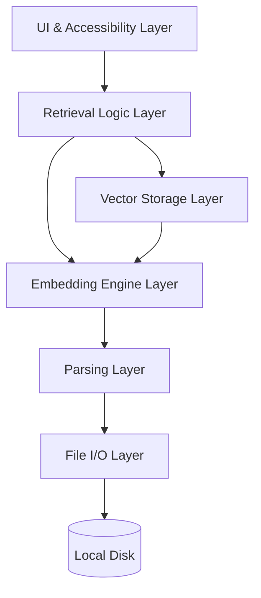
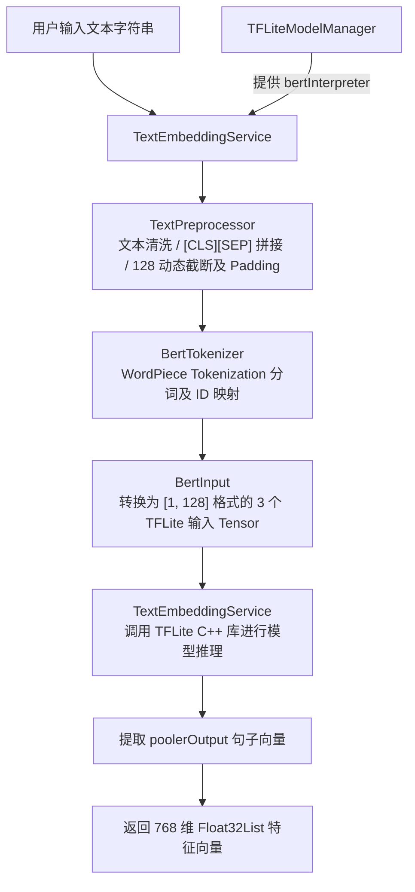
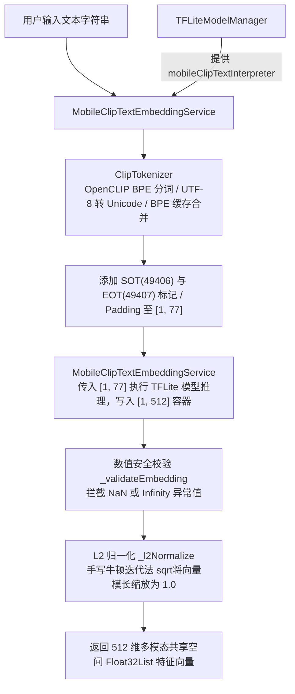

# 架构总览
* 系统采用分层架构设计（Layered Architecture），遵循“单向依赖”原则：上层调用下层提供的服务，下层通过接口（Interfaces）屏蔽具体实现细节。针对离线环境，所有层级均运行在用户本地端侧。


# 详细层级设计
## File I/O Layer
* 核心职责：物理文件访问、跨平台权限校验、流式读取、受管目录配置持久化。
* 核心组件：
  * DirectoryWalker: 递归扫描磁盘目录，按后缀名过滤出合法文件。
  * FilePermissionsChecker: 统一处理 Windows、macOS 和 Linux 的底层物理磁盘读取权限。
  * FileStreamBuffer: 针对大文件（如超长 PDF）提供流式缓冲区，防止摄取时内存溢出。
  * FolderManager: 维护并持久化受管本地文件夹列表。
* 实现文件库与目录管理接口：`addManagedFolder`, `getManagedFolders`, `removeManagedFolder`。

## Parsing Layer (解析层)
* 核心职责：利用底层解析引擎将原始字节流转换为纯文本、结构化元数据及图像位图。
* 核心组件：
  * ParserFactory: 采用策略模式，根据文件后缀（.txt, .pdf, .docx, .jpg, .png）动态路由至对应解析器。
  * PDFiumEngine: 负责 PDF 文档的文本提取及页面高精度位图生成。
    * `pdfrx: ^2.4.4`：作为PDF 解析核心
  * TikaBridge: 封装 Apache Tika，处理 DOCX 和 TXT 文本。
    * `http: ^1.2.0`：用于在本地与 Apache Tika 本地服务器通信 (http://localhost:9998)
    * `archive: ^4.0.9`：许多 docx 文件本质是 zip 压缩包，包含 xml，可用于纯 Dart 离线解析方案
  * OcrEngine: 集成端侧轻量级 OCR 技术，对本地图片、截图和扫描件进行印刷文字识读。
    * 不同平台使用不同的Tesseract程序，通过tika调用，需要先下载安装对应平台的Tesseract程序。
    * `image: ^4.3.0`：用于处理、裁剪、获取图片宽高分辨率等元数据 
  * LocalFileParser：本地文件解析的核心控制中心，它在收到文件路径后，首先会前置检查文件在硬盘上是否存在，若存在则统一提取文件名、大小、修改时间等通用信息；随后通过工厂判断文件后缀，精准分流给对应的专业引擎（如 TXT 原生读取、PDF 提取页数、Docx 桥接解析、图片 OCR 视觉识别）进行文本提取；最后，它还具备强大的批处理能力，能用循环排队处理文件列表，并通过严密的异常保护确保单个文件损坏不中断整体队列，同时实时向外汇报处理进度。
* 实现文件解析模块接口：`parseFile`, `parseBatchFiles`。

##  Embedding Engine Layer (嵌入推理层)
* 核心职责：管理端侧轻量级模型生命周期，执行 TensorFlow Lite 推理并将多模态内容转化为高维特征向量。
  * `tflite_flutter: ^0.12.1`：TensorFlow Lite 的 Dart 版本，用于加载、执行 TFLite 模型，只是接口，对于windows/linux来说需要手动下载底层C/C++动态库，对于MacOS会自动下载底层库。
* 核心组件：
  * TFLiteModelManager: 负责 BERT 和 MobileCLIP 模型的初始化、内存加载与退出释放。
  * models文件夹:
    * EmbeddingTask：是将文本数据或图片数据统一打包成一个标准的对象，以便送入后续的批量处理队列。EmbeddingTask 内部不仅区分 text 与 image 类型，还引入了 `textMode`（默认为 TextEmbeddingMode.bert，可指定 mobileClip）。这使得在 generateBatchEmbeddings 批量任务中，能够同时混合执行 BERT 文本、MobileCLIP 文本与 MobileCLIP 图片的异构向量化。
    * EmbeddingResult：将底层模型（BERT 或 MobileCLIP）计算输出的语义向量或推理过程中产生的错误信息，以一种强类型、不可变（Immutable）的方式封装起来，返回给上层流水线。
    * BertInput：为 TensorFlow Lite (TFLite) 版本的 BERT 模型准备输入数据，并将其从一维的内存数组转换成深度学习引擎所要求的二维矩阵（Tensor）格式。
  * constants文件夹：
    * EmbeddingConstants：全局配置中心，maxSequenceLength=128、模型路径、图片尺寸等常量。
  * exceptions文件夹：
    * EmbeddingException：定义了下面等错误代码，用于异常捕获与错误处理。
      * ERR_MODEL_NOT_READY（模型没有正确初始化）
      * ERR_TXT_EMBED_TIMEOUT（文本推理超时）
      * ERR_IMG_EMBED_TIMEOUT（图片推理超时）
      * ERR_TOKENIZER_NOT_INITIALIZED（分词器未初始化）
      * ERR_VOCABULARY_LOAD_FAILED（词表加载失败）
      * ERR_INVALID_INPUT（输入无效）
      * ERR_INFERENCE_FAILED（推理失败/数值异常拦截）
  * tokenizer文件夹： 
    * BertTokenizer：完整的 BERT WordPiece 分词器，负责将人类输入的原始文本清洗、拆解并转换为模型能识别的最小词汇单元。它通过异步加载本地词汇表，并结合基础分词与贪心子词切分算法，为后续的文本向量化和模型推理提供标准化的输入数据。
    * ClipTokenizer：负责文本特征编码的核心预处理服务。严格对齐 OpenCLIP 官方实现，内部自动串联正则分词、字节级 Unicode 映射、带缓存的 BPE 子词合并及词表完整性校验，将原始文本字符串转换为固定 77 长度的 Int32 Token ID 序列，并采用单例模式管理初始化状态，以保障端侧文本编码与 Python 训练环境的一致性与高效性。
  * preprocess文件夹：
    * TextPreprocessor: 负责文本清洗、Tokenization 分词，并执行 128 Token 动态截断以符合 BERT 输入限制。
    * ImagePreprocessor: 负责图像预处理，强制将本地图片和截图压缩至 $224 \times 224$ 分辨率并进行归一化，以最大化降低 MobileCLIP 的端侧 CPU 计算开销。
  * services文件夹：
    * TextEmbeddingService：调用 BERT TFLite 推理，生成格式为Float32List的text embedding内容。
    * ImageEmbeddingService: 负责图像特征提取的核心推理服务。内部自动串联图像预处理与 MobileCLIP TFLite 模型，将原始图像字节流转换为 512 维的浮点型特征向量（Embedding），并内置了完善的模型状态检查与异常捕获机制，以保障端侧特征提取流程的安全与稳定。
    * MobileClipTextEmbeddingService：负责文本特征提取的核心推理服务。内部自动串联 OpenCLIP 兼容分词器与 MobileCLIP TFLite 文本编码器，将原始文本字符串转换为 512 维 L2 归一化的浮点型特征向量（Embedding），使其可与图像 Embedding 在同一共享空间直接进行余弦相似度检索，并内置了模型/分词器状态校验、输出维度断言、NaN/Infinity 数值异常拦截及零向量防御等多重安全机制，以保障端侧文本特征提取流程的正确性与稳定性。
  * inference文件夹：
    * InferenceQueue: 单例推理队列限流器，严格限制并发数 $\le 2$，防止多线程批量计算导致消费级硬件内存溢出（OOM）或系统卡死。
  * EmbeddingEngine：统一嵌入推理门面，封装文本（BERT）与图像（MobileCLIP）服务，将所有推理任务安全接入 InferenceQueue 进行限流调度，并提供健壮的批量处理机制（通过精细的异常捕获与结果封装），确保异构数据批量向量化时的系统稳定性与结果可追溯性。这个类是整个`embedding layer`的统一入口（Facade模式），把之前分散的 TextEmbeddingService、ImageEmbeddingService、InferenceQueue 整合到一起，对外提供一套简洁、统一的API。
    * EmbeddingEngine 还额外提供了便捷封装：
      * `generateTextEmbedding(text)`：兼容旧版的默认 BERT 文本向量生成。
      * `generateMultimodalTextEmbedding(text)`：专用于多模态检索的 MobileCLIP 文本向量生成。
      * `cosineSimilarity(first, second)`：辅助计算两个同维向量的余弦相似度。
* 实现多模态本地嵌入引擎接口：
  * `generateTextEmbeddingWithMode(String text, {TextEmbeddingMode mode = TextEmbeddingMode.bert})`,
    * 支持通过 mode 切换 BERT (768维) 与 MobileCLIP (512维) 两种文本编码模式。
  * `generateImageEmbedding(Uint8List imageBytes)` (512维) 
  * `generateBatchEmbeddings(List<EmbeddingTask> tasks)`
### text embedding engine(bert-base-uncased & MobileClip-text)开发细节
* bert-base-uncased：768维，128 Token 截断限制

* MobileClip-text：512维，77 Token 截断限制

#### 此项目BERT 与 MobileCLIP-text 关键技术对比总结
| 维度 | BERT (`TextEmbeddingService`) | MobileCLIP-text (`MobileClipTextEmbeddingService`) |
| :--- | :--- | :--- |
| **主要用途** | 纯文本语义检索、长文档检索 (Text-to-Text) | 多模态跨模态检索 (Text-to-Image / Image-to-Text) |
| **向量维度** | **768 维** | **512 维** |
| **Max Sequence** | **128 Token** | **77 Token** |
| **分词算法** | `WordPiece Tokenization`（前缀 `##`，`[CLS]` / `[SEP]`） | `Byte Pair Encoding (BPE)`（字节映射，`SOT` / `EOT`） |
| **输入 Tensor** | **3 个 Tensor** (`attentionMask`, `inputIds`, `tokenTypeIds`) | **1 个 Tensor** (`input_ids` 形状 `[1, 77]`) |
| **归一化处理** | 无需归一化 | **强约束 L2 归一化**（归一化后向量模长为 1） |
| **异常防护** | 模型初始化校验 | 模型/分词器校验 + **NaN/Infinity 数值拦截** + **零向量防御** |
### image embedding engine(MobileClip)开发细节
* 模型转换成合适格式里采用多步中间件转换管线（Multi-stage Pipeline）方法去转换，$224 \times 224$ 分辨率
$$\text{PyTorch} \longrightarrow \text{ONNX} \longrightarrow \text{TensorFlow (SavedModel)} \longrightarrow \text{TFLite (Float16)}$$
* ImageEmbeddingService中进行ImagePreprocessor预处理，将原始图片压缩至 $224 \times 224$ 分辨率并进行归一化，以最大化降低 MobileCLIP 的端侧 CPU 计算开销。然后对ImagePreprocessor预处理结果进行模型推断最后返回一个Float32List格式的一维输出。
```
Input:
[1,224,224,3]
float32
```
* 1：Batch size（批次大小），一次处理1张图片
* 224：	图像高度（Height），224像素
* 224: 图像宽度（Width），224像素
* 3: 通道数（Channels），RGB三通道彩色图
* float32: 32位浮点数，每个像素值通常是归一化后的浮点数（如0~1或做过均值方差标准化）
```
Output:
[1,512]
float32
```
* 1: 对应输入的1张图片
* 512: 这张图片被编码成的特征向量维度（embedding dimension）

## Vector Storage Layer (向量存储层)
* 核心职责：负责本地多模态高维特征向量的持久化存储、双空间物理隔离管理、索引构建以及高效的 K-NN 空间相似度搜索。
  * `chromadb: ^1.4.1`：基于 ChromaDB 的本地向量存储与检索引擎，支持多模态向量（文本/图像）的高效存储与检索，并内置了丰富的向量索引优化策略。此Dart client 支持 getOrCreateCollection()、预计算 embedding 的 add() 和 query()，所以与 Week 3 自己生成 embedding 的架构是匹配的，不需要让 Chroma 再调用自己的 embedding function。
* 核心组件：
  * vector_store_interface.dart：向量存储层的抽象接口契约，定义了向量增删改查的标准规范，用于将上层检索逻辑与具体数据库技术彻底解耦。
  * vector_store/chroma_vector_store.dart：基于本地 Chroma DB 的向量数据库实现类，负责通过双 Collection 物理隔离管理 768 维（文本）与 512 维（图片）向量，并提供距离转相似度评分计算。
  * models文件夹:
    * vector_document.dart：写入向量库的单条记录实体模型，用于封装文件 ID、源路径、文本内容、特征向量数组、空间类型及元数据字典。
    * vector_search_result.dart：向量检索的单条结果输出模型，用于标准化承载从向量库中查出的文档 ID、路径、文本、相关度得分及元数据。
* 实现向量存储核心接口：
  * 向量写入与存储：`addDocument`（插入单条向量文档记录）, `addDocuments`（批量插入多条向量文档记录）
  * 向量相似度检索：`search`（根据输入的查询特征向量检索 Top-K 最相似记录）
  * 数据删除与清理：`deleteDocument`（根据唯一 ID 精准删除单条记录）, `deleteBySourcePath`（根据文件物理路径删除其拆分出的所有 chunk 向量记录）, `clear`（清空指定向量空间类型的全部数据）
  * 状态与数据统计：`count`（统计指定向量空间类型中已持久化的向量总数）
  * 生命周期控制：`initialize`（初始化数据库实例与 Collection 集合）, `dispose`（释放数据库连接及底层资源）

## Retrieval Logic Layer (检索逻辑层)
* 核心职责：负责端到端的文件索引加工流水线（写端），以及“语义向量 + 关键词倒排”的双路独立并行召回与加权融合排序引擎（读端）
* 核心组件：
  * retrieval_engine_interface.dart：检索引擎对外暴露的统一接口规范，定义了上层 UI 与系统交互的文件建索引、删除、重索引及跨模态检索的方法契约。
  * retrieval_engine.dart：整个检索层的统一门面（Facade），负责统一管理引擎生命周期与前置校验，协调协调 DocumentIndexer 与 HybridRetriever 对外提供一站式服务。
  * indexing文件夹：
    * document_indexer.dart：本地文件入库的加工流水线（写端核心），负责将文件分块、提取向量、生成唯一幂等 ID，并“双写”同步存入向量库与倒排索引库。
  * token_filter文件夹：
    * domain_detector.dart：文件领域识别器，根据文件路径和特征后缀自动判断该文件属于代码文件（code）还是通用文档（general）。
    * stop_word_config.dart：停用词与词权重参数配置类，用于集中管理普通词、基础停词、无障碍白名单词及代码关键词等打分权重参数。
    * stop_word_policy.dart：词权重决策引擎，加载英文停用词表并执行五层优先级判定规则，为输入单词计算最终打分权重，同时支持动态高频词挖掘。
  * keyword_index文件夹：
    * keyword_index.dart：内存级倒排索引引擎（底层数据仓库），维护单词到文档 ID 的倒排表与全局词频（DF），并基于五维打分算法实现关键词的独立秒级召回。
  * retrievers文件夹：
    * keyword_retriever.dart：关键词检索业务服务门面，基于倒排索引库封装了纯文本、图片元数据检索及多条件过滤接口，并提供 5 倍候选池自适应放大。
    * vector_retriever.dart：向量语义检索业务服务门面，负责将用户输入的文字或图片转为查询向量，向向量库发起高维空间 K-NN 相似度搜索。
    * hybrid_retriever.dart：双路混合检索与分数融合引擎（读端核心），同时从向量和关键词两路独立捞取候选求并集（UNION），通过 Min-Max 归一化与加权求和输出最终排序结果。
* 实现混合语义检索接口：
  * 文件索引管理：`indexFile`（提取并索引单个文件）, `indexFiles`（批量索引多个文件）, `reindexFile`（重新索引并覆盖旧数据）, `removeFile`（根据文件路径删除其所有分块索引）
  * 多模态检索：`searchText`（文本混合检索：BERT 语义 + 关键词加权）, `searchTextDocuments`（限定纯文本文档类型的检索）, `searchImages`（以文搜图：基于 MobileCLIP 共享空间检索图片）, `searchMultimodal`（带自定义过滤条件的通用多模态检索）
  * 数据库维护与统计：`getTextIndexCount`（获取文本索引总记录数）, `getMobileClipIndexCount`（获取图片索引总记录数）, `clearTextIndex`（清空文本索引库）, `clearMobileClipIndex`（清空图片索引库）
  * 生命周期控制：`initialize`（初始化底层向量集合与状态）, `dispose`（释放数据库连接与底层资源）

## UI Layer (界面与无障碍层)
* 核心职责：构建跨平台响应式图形界面，提供本地文件库管理、多模态混合检索与结果呈现，并深度集成 WCAG 2.1 AA 级无障碍交互体系（纯键盘操作、全局快捷键、NVDA 读屏适配、高对比度与动态字号缩放）。
  * `file_picker: ^11.0.3`：文件选择器，支持多文件选择、文件类型过滤、文件大小限制、文件预览等功能。
    * 在 Windows 上弹出 Windows 资源管理器文件选择窗口，在 macOS/Linux/Android/iOS 上弹出对应系统的原生选择器。
    * 单文件选择：如让用户选择一个 .docx 或 .pdf 文档。
    * 多文件批量选择：按住 Ctrl/Shift 批量选择多个文件。
    * 选择文件夹（目录）：让用户直接选择一个本地文件夹路径进行全量扫描。
    * 保存文件对话框：选择路径导出/另存为文件。
    * 可以限制用户只能选择指定的格式（如 allowedExtensions: ['docx', 'pdf', 'md', 'txt']），其他类型文件在窗口中自动置灰不可选。
* 核心组件：
  * `app_settings_controller.dart`：全局外观与无障碍状态管理器。继承自 ChangeNotifier，集中封装高对比度开关与 100%~200% 的文本缩放比例，在数据变动时通过 notifyListeners() 广播驱动全应用即时响应重绘。
  * `local_retrieval_app.dart`：应用根组件。负责全局响应式主题与字号渲染，监听设置控制器在标准浅色主题与专用高对比度黑黄主题间动态切换，并通过 MediaQuery 实现全应用字体按比例无损缩放。
  * `home_shell.dart`：主界面骨架与导航调度中心。根据窗口宽度自适应在侧边栏与底部导航栏间切换，并使用 IndexedStack 保持页面状态；内置设置页面（含高对比度开关与彻底消除 Windows 读屏崩溃隐患的无障碍字号调节器）；同时负责 Alt+1/2/3 和 Ctrl+F 全局快捷键分发，并在应用退出时主动杀死后台 Tika 进程释放端口。
  * `library_screen.dart`：本地文件库管理页面。通过 file_picker 插件调用系统原生对话框批量导入文档与图片，使用状态机跟踪并展示每个文件的索引进度（支持重新索引与安全删除索引），并通过 liveRegion 实时向屏幕阅读器（NVDA）语音播报处理状态。
  * `search_screen.dart`：多模态混合检索交互页面。支持在“文本文档”与“以文搜图”模式间切换，配合 searchFocusNode 实现 Ctrl+F 快速聚焦搜索框；检索结果以卡片形式结构化呈现排序序号、物理路径、匹配文本摘要、相关度百分比及来源标签，并为检索全流程提供清晰的状态反馈。
* 实现核心交互接口
  * 文件库管理：`pickAndIndexFiles()`（批量选文件并建立索引）, `reindexFile()`（重新索引）, `removeFile()`（删除索引）
  * 检索服务：`searchText()`（文本语义检索）, `searchImages()`（以文搜图）
  * 无障碍配置：`setHighContrastEnabled()`（切换高对比度）, `setTextScaleFactor()`（调节字号缩放）

## APP Layer
* 核心职责：负责整个应用后台基础设施与多模块依赖的统筹组装，按照严格的拓扑顺序初始化各子系统（分词器、模型管理器、嵌入引擎、停用词策略、关键词索引、向量数据库、文件解析器、混合检索器、检索引擎），实现依赖注入（DI），对外输出开箱即用的统一检索引擎实例。
* 核心组件：
  * `app_backend.dart`：整个应用后台的统筹装配工厂。封装 buildRetrievalEngine() 函数，按照依赖拓扑顺序依次初始化分词器、模型管理器、嵌入服务、停用词策略、关键词索引、向量数据库和文档索引器，最后将向量检索与关键词检索以 0.3 : 0.7 权重融合成混合检索器，打包生成统一的 RetrievalEngine 门面供 UI 层使用。
* 实现核心装配接口：
  * 系统装配与初始化：`buildRetrievalEngine()`（异步编排初始化分词器、模型管理器、嵌入服务、停用词策略、关键词索引、向量库和文档索引器，构建混合检索门面并交付给 UI 层）

# 核心交互流程
## Vector Database Integration & Core Retrieval Logic流程
展示该项目的本地文件如何写入数据库和用户输入查询语句时的流程：
```
       【 写端 (数据入库 / Indexing) 】                  【 读端 (用户查询 / Retrieval) 】
    负责：本地文件 ──> 加工成索引数据落盘               负责：用户搜索词 ──> 从索引库查出最匹配的结果
                   │                                                  │
                   ▼                                                  ▼
          DocumentIndexer (总指挥)                           HybridRetriever (总指挥)
           ├── FileParser (解析文件)                          ├── VectorRetriever (读向量)
           ├── EmbeddingEngine (算向量)                       │    └── 查 ChromaVectorStore
           ├── 写入 ChromaVectorStore (向量库)                └── KeywordRetriever (读关键词)
           └── 写入 KeywordIndex (倒排索引库)                      └── 查 KeywordIndex
```

# 技术栈规范 

| 维度 | 规范要求 | 对应功能/非功能需求 |
| :---- | :---- | :--- |
| 异步处理 | 所有的物理文件解析（PDFium/Tika）、OCR 识别和 TFLite 模型推理必须放入 Flutter 后台 Isolate 线程池中执行，绝不允许阻塞 UI 主线程。 | 性能与延迟指标 / 全键盘流畅导航 |
| 内存管理 | 批量摄取流水线必须采用单例批队列（Batch Queue）控制。通过 FileStreamBuffer 限制大文件单次读入块大小，推理阶段并发上限强制置为 2，防止消费级硬件发生 OOM。 | 内存与资源控制 |
| 无障碍实现 | 所有自定义视图组件必须显式指定 semanticsLabel、tooltip 属性。界面色彩对比度、文字主副色调必须无条件达到 WCAG 2.1 AA 硬性指标。 | WCAG 2.1 AA 标准 / 屏幕阅读器适配 |
| 错误处理 | 每一层内部发生的异常（如文件损坏、推理超时、磁盘写保护等）不允许直接向上抛出导致崩溃，必须转换为 TDD 统一规范的错误码（如 ERR_ENGINE_CRASH, ERR_MODEL_NOT_READY），通过 Result<T, E> 包装模式向上传递。 | $\ge 90\%$ 测试覆盖率 |
| 安全审查 | 系统内置日志组件禁止记录任何隐私明文、禁止携带第三方服务 SDK 遥测包。一旦 Retrieval Logic Layer 运行的 runSecurityAudit 触发异常，执行最高优先级的系统控制熔断。| 零网络依赖 / 离线第一 |