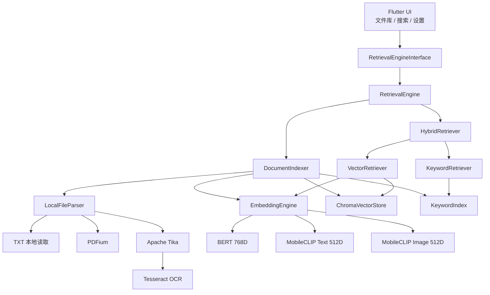
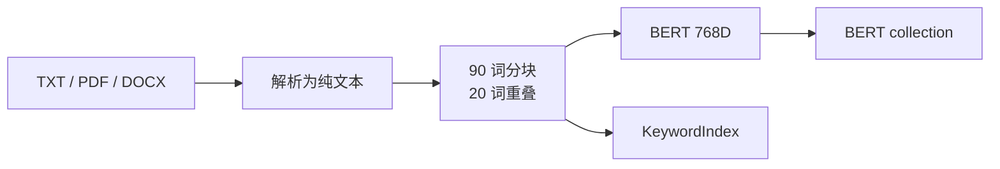
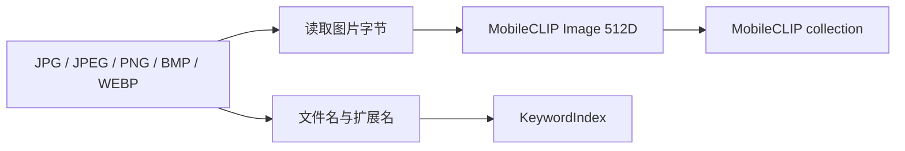
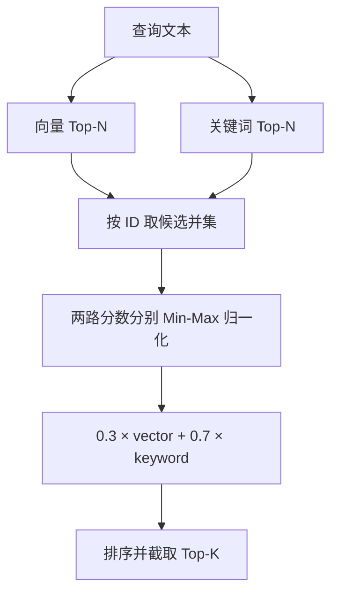

# 离线无障碍多模态本地内容检索系统技术文档

## 1. 文档范围

项目是一个 Flutter 本地内容检索应用，主要提供：

- 本地 TXT、PDF、DOCX 和图片文件的选择与索引管理；
- 基于 BERT 的文本语义检索；
- 基于倒排索引的英文关键词检索；
- 语义分数与关键词分数融合的混合检索；
- 基于 MobileCLIP 的文本搜图片；
- 基于 Apache Tika 与 Tesseract 的英文图片 OCR 能力；
- 面向键盘和屏幕阅读器的无障碍界面。

系统的计算和文件处理均在本机执行。Apache Tika 和 ChromaDB 通过本机回环地址通信，不依赖云端内容处理服务。

## 2. 技术栈

| 范围 | 当前实现 |
|---|---|
| 客户端 | Flutter、Dart、Material 3 |
| 文本向量 | BERT TFLite，768 维 |
| 图文向量 | MobileCLIP TFLite，512 维共享空间 |
| 模型运行时 | `tflite_flutter` |
| PDF 解析 | `pdfrx` / PDFium |
| DOCX 解析 | Apache Tika Server 3.3.1 |
| 图片 OCR | Flutter → Tika → Tesseract，当前配置为英文 `eng` |
| 图片预处理 | `image` |
| 向量存储 | ChromaDB，Dart 客户端 `chromadb` |
| 关键词检索 | 项目内存倒排索引、TF、DF、IDF 和短语/顺序匹配 |
| 文件选择 | `file_picker` |
| 测试 | `flutter_test`、`mocktail` |

项目 Dart SDK 约束为 `^3.12.2`，应用版本配置为 `1.0.0+1`。

## 3. 总体架构

系统采用分层和依赖注入结构。UI 只依赖 `RetrievalEngineInterface`，不直接操作解析器、模型或数据库。



### 3.1 主要分层

- `lib/ui/`：界面、导航、文件库状态、搜索状态和无障碍设置。
- `lib/app/`：后端依赖组装和初始化。
- `lib/parsing/`：文件类型识别、文本提取、PDF、Tika 和 OCR 桥接。
- `lib/embedding/`：模型生命周期、分词、预处理、推理限流和向量生成。
- `lib/retrieval/`：文件索引、向量存储、关键词索引、检索和结果融合。
- `assets/`：BERT、MobileCLIP、词表、BPE 词表和英文停用词资源。
- `test/`：解析、嵌入、检索、性能基准、Widget 和 Semantics 测试。

## 4. 应用启动与依赖组装

入口位于 `lib/main.dart`。

启动顺序如下：

1. 初始化 Flutter binding；
2. 调用 `pdfrxFlutterInitialize()` 初始化 PDFium；
3. 调用 `buildRetrievalEngine()` 构建后端；
4. 加载 BERT、MobileCLIP 图片编码器和 MobileCLIP 文本编码器；
5. 初始化 BERT WordPiece tokenizer 和 CLIP BPE tokenizer；
6. 从 `assets/retrieval/stopwords_en.json` 加载英文停用词策略；
7. 构造关键词索引、Chroma 向量存储、索引器和两路检索器；
8. 初始化 ChromaDB 的两个 collection；
9. 启动 `LocalRetrievalApp`。

任一后端初始化步骤失败时，程序不会进入正常主页，而是显示可被辅助技术感知的初始化错误页。该页面会提示检查本地 ChromaDB 服务，并显示具体异常信息。

生产依赖组装中的混合检索权重为：

- 向量权重：`0.3`；
- 关键词权重：`0.7`；
- 每一路候选扩展倍数：默认 `5`。

项目的 NQ 100 条样本调权结果中，这组配置的 Recall@1 为 0.91、Recall@5 为 0.97、Recall@10 为 0.98、MRR 为 0.9398，因此被写入当前后端配置。

## 5. 文件解析层

### 5.1 统一接口与结果模型

`FileParserInterface` 提供：

```dart
Future<ParseResult> parseFile(String filePath);
Stream<BatchProgress> parseBatchFiles(List<String> filePaths);
```

`ParseResult` 统一保存解析是否成功、文件类型、提取文本、元数据、错误代码和错误说明。批量解析通过 `BatchProgress` 逐个发送进度，单个文件失败不会中止整个批次。

基础元数据包括：

- `fileName`；
- `filePath`；
- `fileSize`；
- `lastModified`；
- PDF 的 `pageCount`；
- 图片的 `width` 和 `height`。

### 5.2 格式处理

| 格式 | 解析实现 | 输出 |
|---|---|---|
| TXT | `File.readAsString()`，通过 `compute` 执行 | 原始文本 |
| PDF | `pdfrx` / PDFium，逐页调用 `loadText()` | 合并后的页面文本和页数 |
| DOCX | 本地 Tika Server 的 `PUT /tika` | UTF-8 纯文本 |
| JPG、PNG | Tika 调用 Tesseract | 英文 OCR 文本和图片尺寸 |

`ParserFactory` 当前直接识别 `.txt`、`.pdf`、`.docx`、`.jpg` 和 `.png`。Tika OCR 桥接本身也接受 `.jpeg`，但 `.jpeg` 尚未被 `ParserFactory` 的图片分支识别。

### 5.3 Tika 服务管理

`TikaBridge` 使用固定回环地址：

- 服务地址：`http://127.0.0.1:9998/tika`；
- 健康检查：`http://127.0.0.1:9998/version`；
- 启动等待上限：30 秒；
- DOCX 请求超时：60 秒；
- OCR 请求超时：120 秒。

第一次需要 DOCX 或 OCR 时，系统先检查服务是否已存在。若未运行，则执行：

```text
java -jar tika-server-standard-3.3.1.jar
  --config tika-config.xml
  --noFork
  --host 127.0.0.1
  --port 9998
```

静态 `_starting` Future 用于防止并发请求重复启动多个 Tika 进程。标准输出和错误输出均被持续消费，避免子进程管道堵塞。由应用创建的 Tika 进程会在 `HomeShell` 销毁或应用进入 detached 状态时终止；已经由用户独立启动的服务不会被该清理逻辑结束。

### 5.4 OCR 配置

OCR 数据流为：

```text
图片文件 → Flutter → 本机 Tika HTTP 服务 → Tesseract → 英文文本
```

当前配置：

- OCR 语言：`eng`；
- Page Segmentation Mode：`3`；
- 支持的 OCR MIME 类型：PNG 和 JPEG；
- Tesseract 数据目录由 `TESSDATA_PREFIX` 指定。

Windows 依次在以下位置查找 Tesseract：

1. EXE 同级的 `tesseract/`；
2. 项目开发目录 `lib/document_parsing_tool/tesseract/`；
3. `C:\Program Files\Tesseract-OCR`。

macOS 和 Linux 不使用项目内 Windows 二进制文件，要求系统 `PATH` 中存在 Tesseract。

## 6. 嵌入层

### 6.1 模型和语义空间

| 模型 | 输入 | 输出 | 用途 |
|---|---|---|---|
| BERT | 文本 token，最大长度 128 | 768 维向量 | 文本到文本检索 |
| MobileCLIP Text | CLIP token，固定长度 77 | 512 维向量 | 文本到图片检索 |
| MobileCLIP Image | 224 × 224 RGB 图片 | 512 维向量 | 图片索引和图像相似度 |

BERT 向量和 MobileCLIP 向量属于不同空间，不能互相比较。代码使用 `VectorEmbeddingType.bert` 和 `VectorEmbeddingType.mobileClip` 强制区分。

### 6.2 模型资源

- `assets/bert_model/bert.tflite`；
- `assets/bert_model/vocab.txt`；
- `assets/mobileclip_model/mobileclip_image.tflite`；
- `assets/mobileclip_model/mobileclip_text.tflite`；
- `assets/mobileclip_model/bpe_simple_vocab_16e6.txt`。

`TFLiteModelManager` 是单例，统一持有三个 TFLite `Interpreter`，并提供关闭原生模型资源的方法。

### 6.3 分词和预处理

- BERT 使用 WordPiece 词表，加入 `[CLS]`、`[SEP]`、`[PAD]` 和 `[UNK]`，最大序列长度为 128；
- MobileCLIP 文本使用与 OpenCLIP 兼容的 byte-level BPE，词表大小为 49,408，SOT 为 49,406，EOT 为 49,407；
- MobileCLIP 图片会被解码、缩放为 224 × 224 RGB，并转换为浮点输入；
- 文本和图片推理统一通过 `InferenceQueue` 调度，最大并发数为 2；
- 批量嵌入会分别返回每个任务的成功或错误结果，单个失败不会取消其他任务。

`EmbeddingEngine` 还提供余弦相似度函数，并检查两个向量的维度是否一致。

## 7. 索引流程

`DocumentIndexer` 是文件入库入口，同时维护 Chroma 向量索引和内存关键词索引。

### 7.1 文本文档索引



具体行为：

1. 检查文件存在；
2. 使用 `LocalFileParser` 提取文本；
3. 合并多余空白；
4. 按最多 90 个词分块，相邻块重叠 20 个词；
5. 先删除同一路径的旧向量和旧关键词记录；
6. 为每个 chunk 生成 BERT 768 维向量；
7. 将相同 ID、来源路径、正文和元数据分别写入两套索引。

文本元数据包括：

- `data_type: text`；
- `file_name`；
- `file_extension`；
- `chunk_index`；
- `chunk_count`。

### 7.2 图片索引



图片索引器接受 `.jpg`、`.jpeg`、`.png`、`.bmp` 和 `.webp`。一张图片对应一条 MobileCLIP 记录。图片内容字段为 `null`，关键词分支目前主要索引 `file_name`。

需要特别区分两个能力：解析层已经实现英文 OCR，但当前 `DocumentIndexer._indexImage()` 直接读取图片并生成 MobileCLIP 向量，没有调用 `LocalFileParser` 或 `OcrEngine`。因此 OCR 结果目前不会自动写入图片索引，也不会参与图片关键词检索。当前文本搜图片依靠 MobileCLIP 视觉语义和文件名关键词。

### 7.3 ID、重建和删除

索引 ID 由文件完整路径规范化生成：非字母数字字符替换为下划线、合并连续下划线并转为小写。文本记录附加 `_chunk_<序号>`，图片记录附加 `_image`。

- `indexFile()`：索引单个文件并返回 `IndexingResult`；
- `indexFiles()`：串行索引多个文件，保留每个文件的独立结果；
- `removeFile()`：同时删除 Chroma 和关键词索引中的对应路径记录，不删除原始文件；
- `reindexFile()`：先删除旧记录，再重新索引。

## 8. 存储设计

### 8.1 ChromaDB

`ChromaVectorStore` 管理两个相互隔离的 collection：

| Collection | 维度 | 内容 |
|---|---:|---|
| `bert_text_embeddings` | 768 | 文本文档 chunk |
| `mobileclip_embeddings` | 512 | 图片向量 |

每条 Chroma 记录包含：

- 唯一 ID；
- embedding；
- 文本正文，图片为空字符串；
- 元数据；
- 保留字段 `source_path`、`embedding_type` 和 `embedding_dimension`。

写入和查询前会校验向量维度、有限数值、非空 ID 和非空来源路径。Chroma 距离通过 `1 / (1 + distance)` 转换为分数，分数越高表示越接近。

ChromaDB 数据是否跨应用重启保留，取决于本地 Chroma 服务的持久化配置。Flutter 应用本身不管理 Chroma 服务进程，也不配置其数据目录。

### 8.2 关键词索引

`KeywordIndex` 是应用进程内的倒排索引，维护：

- `document ID → KeywordIndexedDocument`；
- `token → document ID 集合`；
- `token → document frequency`。

可搜索内容由以下字段拼接：

1. `content`；
2. `file_name`；
3. `title`；
4. `caption`；
5. `description`。

当前分词规则面向英文：转小写，保留英文字母、数字、下划线、连字符、点和撇号。关键词分数由以下部分组成：

```text
0.45 × 查询词覆盖率
+ 0.20 × TF 分数
+ 0.20 × IDF 分数
+ 0.10 × 完整短语匹配
+ 0.05 × 顺序匹配
```

停用词策略结合英文停用词表、无障碍相关白名单、代码领域重要词和动态文档频率。`DomainDetector` 会依据来源路径识别领域并影响 token 权重。

关键词索引没有序列化到磁盘，应用重启后需要重新建立；它不会从已有 Chroma collection 自动恢复。

## 9. 检索与结果融合

### 9.1 向量检索

`VectorRetriever` 支持：

- `searchText()`：查询文本经 BERT 编码后搜索 768 维文本 collection；
- `searchTextDocuments()`：在文本 collection 中附加 `data_type = text` 过滤；
- `searchMultimodal()`：查询文本经 MobileCLIP Text 编码后搜索 512 维 collection；
- `searchImages()`：在 MobileCLIP collection 中附加 `data_type = image` 过滤；
- `searchByImage()`：使用图片向量搜索 MobileCLIP collection；
- `searchByEmbedding()`：调用者提供已生成的向量直接查询。

其中图片查询和直接向量查询属于内部实现能力，当前 UI 和 `RetrievalEngineInterface` 没有暴露图片作为查询输入的操作。

### 9.2 关键词检索

`KeywordRetriever` 是关键词索引的门面，支持普通查询、纯文本查询、纯图片查询、元数据精确过滤和按 ID 查询。过滤采用 AND 逻辑，键和值都必须与元数据完全相等。

### 9.3 混合融合

混合检索不是只对向量候选重新排序，而是对两路候选取并集：



当一组分数只有一个元素或全部相同时，该组归一化结果统一设为 1.0。最终排序依次比较：

1. 混合总分；
2. 归一化关键词分数；
3. 归一化向量分数。

`HybridSearchResult` 同时保留原始分数、归一化分数、最终分数，以及 `foundByVector`、`foundByKeyword` 标志，因此 UI 可以显示“语义 + 关键词”“语义匹配”或“关键词匹配”。

### 9.4 对外检索接口

UI 使用的 `RetrievalEngineInterface` 公开：

```dart
Future<IndexingResult> indexFile(String filePath);
Future<List<IndexingResult>> indexFiles(List<String> filePaths);
Future<void> removeFile(String filePath);
Future<IndexingResult> reindexFile(String filePath);

Future<List<HybridSearchResult>> searchText({
  required String query,
  int topK = 10,
  Map<String, dynamic>? filters,
});

Future<List<HybridSearchResult>> searchImages({
  required String query,
  int topK = 10,
});
```

具体类 `RetrievalEngine` 还提供文本专用检索、多模态检索、collection 计数、清空和资源释放方法，但这些没有全部声明在 UI 使用的接口中。

## 10. 用户界面

### 10.1 页面和响应式导航

应用包含三个页面：

- 文件库；
- 搜索；
- 设置。

窗口宽度不小于 720 像素时使用左侧 `NavigationRail`，较窄时使用底部 `NavigationBar`。三个页面放在 `IndexedStack` 中，切换页面时保留各页状态。

全局快捷键由 `HardwareKeyboard` handler 处理：

| 快捷键 | 功能 |
|---|---|
| Alt + 1 | 打开文件库 |
| Alt + 2 | 打开搜索页 |
| Alt + 3 | 打开设置页 |
| Ctrl + F | 打开搜索页并聚焦搜索框 |
| Command + F | macOS 对应的搜索快捷键 |

### 10.2 文件库

文件选择器允许多选：TXT、PDF、DOCX、PNG、JPG、JPEG、BMP 和 WEBP。每个文件显示索引中、索引成功或索引失败状态，以及索引记录数量和来源路径。

用户可以：

- 添加并索引多个文件；
- 重新索引；
- 删除索引；
- 在删除前确认原始文件不会被删除。

文件库列表只保存在当前 UI 状态中，没有从 ChromaDB 恢复已索引文件清单的逻辑。因此应用重启后，即使 Chroma 向量仍存在，文件库页面也会重新显示为空。

### 10.3 搜索页

搜索页提供“文本文档”和“图片”两种模式：

- 文本文档：调用 `searchText()`，并传入 `data_type = text`；
- 图片：调用 `searchImages()`；
- 默认返回最多 10 条结果；
- 结果展示文件名、来源路径、内容摘要、相关度百分比、数据类型和匹配来源；
- 文本摘要最多显示 240 个字符；
- 图片当前不直接显示缩略图，而是显示图片结果说明。

### 10.4 设置页

设置状态由 `AppSettingsController` 管理：

- 高对比度模式；
- 文字缩放 100% 至 200%；
- 每次增减 25%。

高对比度主题使用黑色背景、白色正文、黄色主色和青色辅助色。文字缩放通过 `MediaQuery.textScaler` 应用于整个应用。

## 11. 无障碍实现

当前界面包含以下无障碍设计：

- 页面标题和“搜索结果”等区域使用 `Semantics(header: true)`；
- 文件索引进度和搜索状态使用 `Semantics(liveRegion: true)`；
- 搜索框具备可感知的 label 和 hint；
- 相关度提供“相关度 X 百分比”的语义标签；
- 加载指示器提供“正在搜索”语义；
- 文字缩放控件使用 `Semantics(slider: true)`，提供当前值、增加值、减少值及 increase/decrease 动作；
- 同时提供“减小文字”和“增大文字”按钮，方便键盘和屏幕阅读器用户操作；
- 页面使用 `OrderedTraversalPolicy` 控制焦点遍历；
- 所有主要操作均使用标准 Flutter Material 控件，保留平台辅助技术行为；
- 已配置全局键盘快捷键，鼠标点击导航后仍由硬件键盘 handler 接收。

Windows 上已针对 NVDA 使用场景将原生 `Slider` 的可访问性交互替换为 `Semantics + LinearProgressIndicator + 两个按钮`，以避免 Flutter Windows 语义树更新异常，同时保留增加、减少和键盘操作。

## 12. 错误处理和资源生命周期

### 12.1 输入和数据校验

- 空查询和非正数 `topK` 会抛出参数异常；
- 未初始化的向量存储或检索引擎会抛出状态异常；
- 不存在或不支持的文件会返回结构化解析/索引失败结果；
- 向量写入前校验维度和数值有效性；
- 图片字节为空时拒绝生成索引；
- 文本解析为空时不会写入空记录。

### 12.2 资源释放

- PDF 文档句柄在 `finally` 中释放；
- Chroma 客户端由 `dispose()` 关闭；
- TFLite interpreter 提供显式关闭方法；
- `FocusNode`、`TextEditingController` 和 `ChangeNotifier` 随 Widget 生命周期释放；
- 应用创建的 Tika 子进程在应用退出时终止。

## 13. 测试结构

项目测试分为以下类别：

| 路径 | 覆盖范围 |
|---|---|
| `test/parsing/parsing_layer_test.dart` | 工厂映射、文件不存在、未知格式、TXT、PDF、Tika、OCR 和批处理流 |
| `test/embedding/bert_model_test.dart` | BERT 模型输入输出信息 |
| `test/embedding/clip_tokenizer_test.dart` | OpenCLIP token 一致性、边界、长度、截断和确定性 |
| `test/embedding/text_embedding_service_test.dart` | 文本向量生成、有限值和确定性 |
| `test/embedding/image_embedding_service_test.dart` | 图片向量与无效图片异常 |
| `test/embedding/mobileclip_*` | MobileCLIP 文本/图片模型和服务 |
| `test/embedding/embedding_engine_test.dart` | 嵌入门面、模式选择、批处理、错误隔离和余弦相似度 |
| `test/embedding/NQ_COCO_validation_test.dart` | NQ 文本检索和 COCO 图文检索验证 |
| `test/retrieval/retrieval_engine_test.dart` | 索引、删除、向量、关键词、混合检索和参数校验 |
| `test/retrieval/retrieval_benchmark_test.dart` | NQ、COCO 的 Recall、MRR 和查询延迟 |
| `test/retrieval/hybrid_weight_tuning_test.dart` | 多组向量/关键词权重调优 |
| `test/widget_test.dart` | 页面导航、搜索、文件库、设置、快捷键和 Semantics |

基准测试依赖外部数据集路径和本地 ChromaDB，模型测试也需要真实 TFLite 资源，因此不应把所有测试都视为无需环境准备的快速单元测试。

## 14. 构建和运行依赖

### 14.1 通用依赖

运行完整功能前需要：

- Flutter 和兼容的 Dart SDK；
- 可用的本地 ChromaDB 服务；
- Java 运行时，用于启动 Tika Server；
- 项目声明的 TFLite 模型和词表资源；
- 本机文件读取权限。

### 14.2 Windows

Windows 的 `CMakeLists.txt` 会将以下内容复制到构建产物：

- Flutter 资源和原生插件库；
- `libtensorflowlite_c-win.dll`，如果 `blobs/` 中存在；
- Tika Server JAR 和 `tika-config.xml`；
- 完整的 Windows Tesseract 目录及 `eng.traineddata`。

构建时如果 Tika JAR、Tika 配置、`tesseract.exe` 或英文训练数据缺失，CMake 会直接报错，避免生成不完整的发布包。

### 14.3 macOS 和 Linux

代码层面对 macOS 和 Linux 使用系统 `PATH` 中的 Tesseract，但当前看到的自定义打包逻辑位于 Windows `CMakeLists.txt`。在 macOS/Linux 发布前仍需单独处理：

- 安装 Tesseract 和英文语言数据；
- 确认 Java 可用；
- 将 Tika JAR 与配置放到程序能找到的位置，或补充对应平台的打包脚本；
- 验证 TFLite 原生运行库和桌面插件兼容性。

Android 和 iOS 目录保留 Flutter 标准平台工程，但当前 Tika 子进程方案依赖执行本机 Java 命令，不能仅凭现有代码直接视为移动端可发布实现。

## 15. 当前实现边界

以下内容是根据当前代码确认的边界，维护时需要重点注意：

1. **OCR 与图片索引尚未连接**：OCR 能独立提取英文文字，但图片索引没有保存 OCR 文本。
2. **关键词索引不持久化**：应用重启后需要重新索引，已有 Chroma 向量无法单独恢复完整混合检索状态。
3. **文件库 UI 不恢复历史记录**：页面只显示本次运行中添加的文件。
4. **ChromaDB 不由应用启动**：用户需要在运行应用前启动本地服务。
5. **Tika 使用固定端口 9998**：端口冲突会导致启动失败。
6. **解析格式存在边界差异**：文件选择器和图片向量索引支持 JPEG、BMP、WEBP，但 `ParserFactory` 的 OCR 解析入口目前只识别 JPG 和 PNG。
7. **关键词处理以英文为主**：当前正则分词会移除中文等非 `a-z0-9` 字符，停用词资源也是英文。
8. **图片结果不显示预览**：搜索结果只有图标、路径和说明。
9. **图像作为查询尚未进入 UI**：底层有 `searchByImage()`，公开 UI 接口只提供文本搜文本和文本搜图片。
10. **跨平台发布仍以 Windows 最完整**：Windows 已包含 Tika/Tesseract 打包步骤，其他桌面平台需要额外部署工作。

## 16. 维护和扩展建议

### 16.1 将 OCR 文本用于检索

若需要让图片中的英文文字参与关键词或 BERT 检索，应在图片索引阶段调用 OCR，并将结果写入 `content` 或 `metadata['description']`。需要同时决定 OCR 文本进入哪一个向量空间：

- 作为关键词字段加入当前图片记录；
- 另建 BERT 文本记录用于文字内容检索；
- 保留 MobileCLIP 图片记录用于视觉语义检索。

### 16.2 恢复混合检索状态

若需要应用重启后立即搜索，不能只依赖 ChromaDB。还应持久化并恢复关键词索引和文件库清单，或者在启动时根据文件清单重建关键词索引。

### 16.3 扩展公共接口

如 UI 未来需要图片查询、索引计数或清空索引，应先扩展 `RetrievalEngineInterface`，保持 UI 继续依赖抽象而不是具体类。

### 16.4 跨平台发布

发布 macOS/Linux 前，应为 Tika、Tesseract 和 TFLite 原生库建立与 Windows 等价的安装检查和打包步骤，并在目标系统上执行真实 OCR、模型推理和辅助技术验证。

## 17. 关键源码索引

| 功能 | 文件 |
|---|---|
| 程序入口 | `lib/main.dart` |
| 后端依赖组装 | `lib/app/app_backend.dart` |
| 应用主题 | `lib/ui/local_retrieval_app.dart` |
| 导航、快捷键和设置 | `lib/ui/home_shell.dart` |
| 文件库 | `lib/ui/library_screen.dart` |
| 搜索页 | `lib/ui/search_screen.dart` |
| 文件解析入口 | `lib/parsing/local_file_parser.dart` |
| Tika/Tesseract 桥接 | `lib/parsing/tika_bridge.dart` |
| OCR 封装 | `lib/parsing/ocr_engine.dart` |
| 模型生命周期 | `lib/embedding/model_manager.dart` |
| 嵌入门面 | `lib/embedding/embedding_engine.dart` |
| 文件索引 | `lib/retrieval/indexing/document_indexer.dart` |
| ChromaDB 实现 | `lib/retrieval/vector_store/chroma_vector_store.dart` |
| 关键词索引 | `lib/retrieval/keyword_index/keyword_index.dart` |
| 向量检索 | `lib/retrieval/retrievers/vector_retriever.dart` |
| 关键词检索 | `lib/retrieval/retrievers/keyword_retriever.dart` |
| 混合融合 | `lib/retrieval/retrievers/hybrid_retriever.dart` |
| 检索统一门面 | `lib/retrieval/retrieval_engine.dart` |
| UI 使用的检索接口 | `lib/retrieval/retrieval_engine_interface.dart` |

